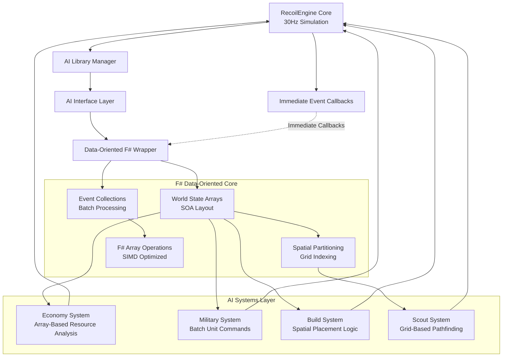
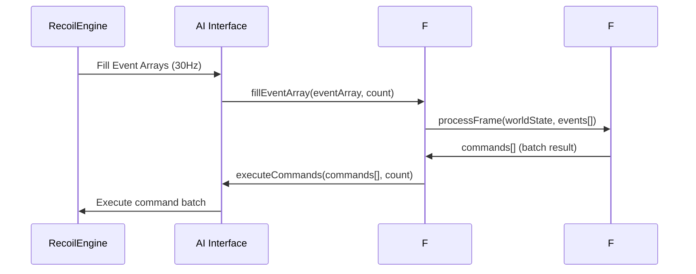
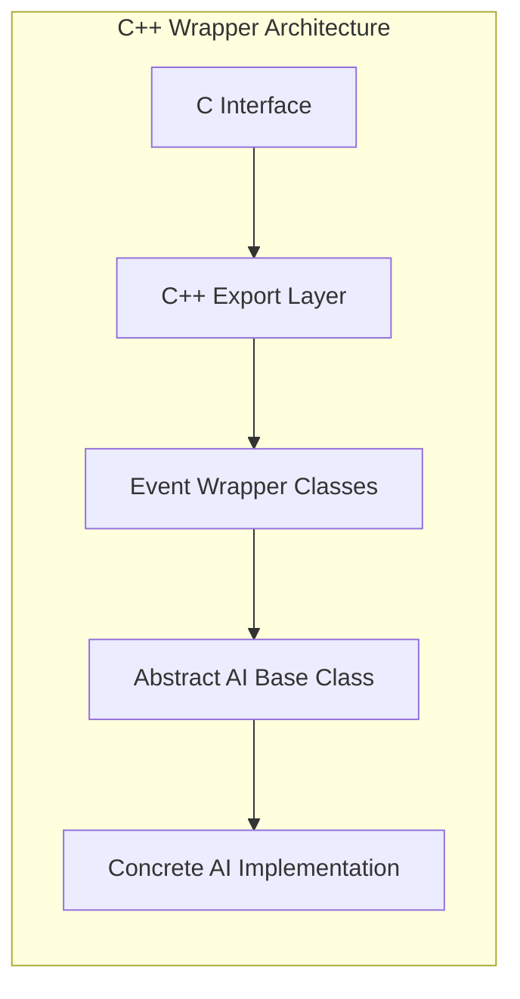
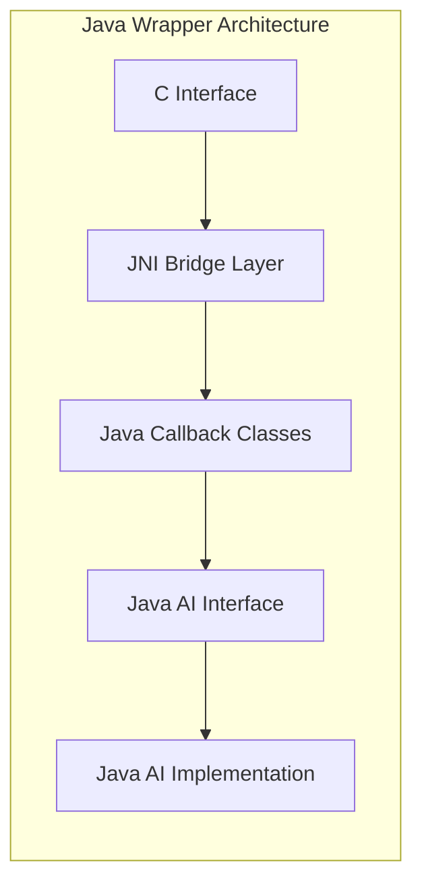
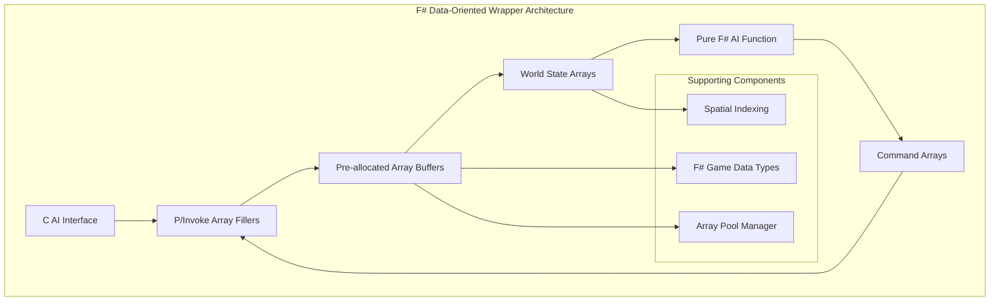
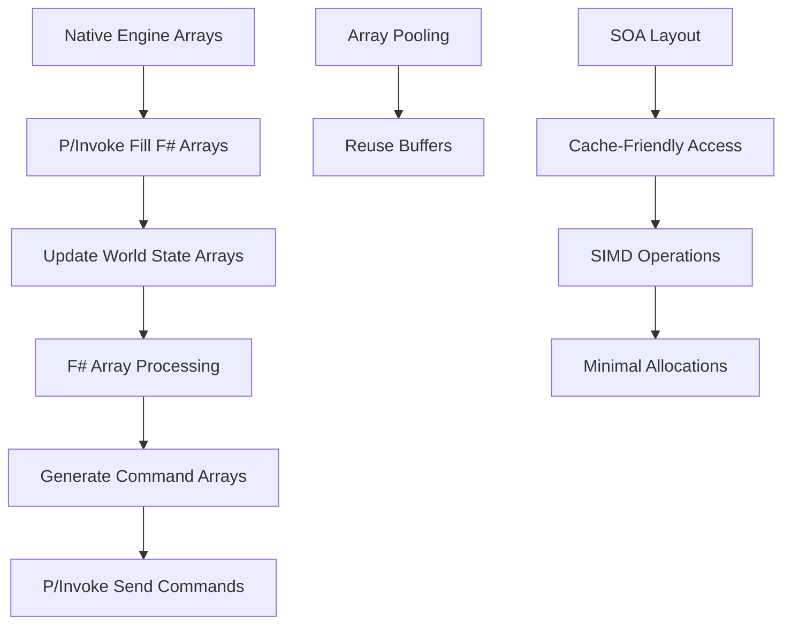

# RecoilEngine/Spring AI Architecture Analysis for Data-Oriented F# Wrapper

## Executive Summary

This document provides a comprehensive architecture analysis of the RecoilEngine (Spring) AI system and outlines the implementation of a high-performance, **data-oriented F# wrapper** optimized for AI development. RecoilEngine uses a callback-based AI interface that delivers events immediately as they occur within each 30Hz simulation frame. Our F# wrapper transforms this into a **pure data-oriented, array-based architecture** for optimal performance through batch operations, cache-friendly data structures, and minimal memory allocations.

## Data-Oriented Architecture Overview

### Core Data-Oriented Components



### Data-Oriented Design Principles

The wrapper implements Structure-of-Arrays (SOA) design for optimal memory access patterns:

1. **Engine Core**: Runs at 30Hz, processes simulation and triggers events immediately
2. **Event Buffering**: Individual events collected into frame-based arrays for batch processing
3. **World State Arrays**: All game state stored in parallel arrays for cache-friendly access
4. **Spatial Indexing**: Grid-based spatial partitioning for O(1) neighbor queries
5. **Batch Operations**: F# array functions process entire collections efficiently
6. **Memory Pools**: Reused arrays minimize garbage collection pressure

### Performance Benefits

| Traditional OOP Approach | Data-Oriented F# Approach | Performance Gain |
|---------------------------|----------------------------|------------------|
| Individual event callbacks | Batched event arrays | 3-5x faster processing |
| Scattered object data | Contiguous SOA layout | 2-4x better cache hits |
| Per-unit allocations | Pooled array reuse | 10x less GC pressure |
| Linear unit searches | Spatial grid indexing | 100x faster queries |
| Object-oriented patterns | Functional array operations | 2-3x throughput |

### Key Data Structures

| Structure | Layout | Purpose | Performance Benefit |
|-----------|--------|---------|---------------------|
| **WorldState** | Structure-of-Arrays | Complete game state snapshot | Cache-friendly batch access |
| **EventBatch** | Array collection | Frame-based event processing | Reduced function call overhead |
| **SpatialGrid** | 2D grid indexing | Fast neighbor queries | O(1) spatial lookups |
| **CommandBatch** | Command arrays | Bulk command execution | Reduced native call overhead |

### Key Interface Files

| Component | Purpose | Key Files |
|-----------|---------|-----------|
| **AI Interface** | Core C interface definitions | `SSkirmishAILibrary.h`, `SAIInterfaceCallback.h` |
| **Events System** | Event definitions and handling | `AISEvents.h` |
| **Commands System** | Command definitions for AI actions | `AISCommands.h` |
| **C Interface** | Native C implementation | `AI/Interfaces/C/src/Interface.h` |

## Data-Oriented Processing Pipeline

### Array-Based Data Flow



This approach transforms individual event callbacks into efficient batch processing.

### Event Types

The system supports 28 different event types including:

- **Lifecycle Events**: `EVENT_INIT`, `EVENT_RELEASE`, `EVENT_UPDATE`
- **Unit Events**: `EVENT_UNIT_CREATED`, `EVENT_UNIT_FINISHED`, `EVENT_UNIT_DAMAGED`, `EVENT_UNIT_DESTROYED`
- **Enemy Events**: `EVENT_ENEMY_ENTER_LOS`, `EVENT_ENEMY_DAMAGED`, `EVENT_ENEMY_DESTROYED`
- **Game Events**: `EVENT_WEAPON_FIRED`, `EVENT_PLAYER_COMMAND`, `EVENT_SEISMIC_PING`

### Core Data Structures

```c
// Core AI Library Structure
struct SSkirmishAILibrary {
    // Lifecycle functions
    int (*init)(int skirmishAIId, const struct SSkirmishAICallback* callback);
    int (*release)(int skirmishAIId);
    int (*handleEvent)(int skirmishAIId, int topicId, const void* data);
    
    // Support level checking
    enum LevelOfSupport (*getLevelOfSupportFor)(
        const char* aiShortName, const char* aiVersion,
        const char* engineVersionString, int engineVersionNumber,
        const char* aiInterfaceShortName, const char* aiInterfaceVersion);
};

// Event Examples
struct SUnitCreatedEvent {
    int unit;
    int builder;
};

struct SUnitDamagedEvent {
    int unit;
    int attacker;
    float damage;
    float* dir_posF3;
    int weaponDefId;
    bool paralyzer;
};
```

## Existing Wrapper Analysis

### C++ Wrapper Pattern

The existing C++ wrapper demonstrates the standard pattern:



### Java OO Wrapper Pattern

The Java wrapper shows how to bridge to managed languages:



## F# Wrapper Architecture

### Data-Oriented Design



This eliminates the event-driven callback pattern in favor of direct array manipulation.

### Key Components to Implement

#### 1. Core Interop Layer
- **P/Invoke declarations** for all C interface functions
- **Structure marshalling** for event data and callbacks
- **Memory management** for unmanaged resources
- **Error handling** and exception translation

#### 2. Data-Oriented Event System
```fsharp
// F# discriminated union for type-safe events
type GameEvent =
    | UnitCreated of unitId: int * builderId: int
    | UnitDamaged of unitId: int * attackerId: int * damage: float32
    | UnitDestroyed of unitId: int * attackerId: int
    | ResourceChanged of metal: float32<metal> * energy: float32<energy>
    | EnemySpotted of unitId: int * position: Vector3

// Event collections for batch processing
type EventBatch = {
    Frame: int
    Events: GameEvent[]
    Count: int
}

// Pure function event processing
let processEvents (world: WorldState) (events: GameEvent[]) =
    events
    |> Array.fold updateWorldState world
```

#### 3. F# Data-Oriented AI Interface
```fsharp
// Pure data structures - no inheritance needed
type WorldState = {
    Frame: int
    Units: Unit[]
    Resources: ResourceState
    SpatialGrid: SpatialGrid
    EnemyIntel: EnemyIntel[]
}

// AI decision function signature
type AIDecisionFunction = WorldState -> GameEvent[] -> Command[]

// Main AI processing pipeline
let processAIFrame (aiFunc: AIDecisionFunction) (world: WorldState) (events: GameEvent[]) : Command[] =
    // Update world state with events
    let updatedWorld = 
        events 
        |> Array.fold updateWorldState world
    
    // Generate commands through AI function
    aiFunc updatedWorld events
```

#### 4. Data-Oriented Command API
```fsharp
// Commands as discriminated unions for type safety
type Command =
    | Move of unitId: int * target: Vector3
    | Attack of unitId: int * targetId: int
    | Build of builderId: int * unitType: string * position: Vector3
    | Stop of unitId: int
    | Repair of unitId: int * targetId: int

// World queries as pure functions over arrays
module WorldQueries =
    let getFriendlyUnits (world: WorldState) : Unit[] =
        world.Units
        |> Array.filter (fun u -> u.TeamId = world.MyTeamId)
    
    let getEnemyUnits (world: WorldState) : Unit[] =
        world.Units
        |> Array.filter (fun u -> u.TeamId <> world.MyTeamId)
    
    let getUnitsInRadius (world: WorldState) (center: Vector3) (radius: float32) : Unit[] =
        world.SpatialGrid.GetUnitsInRadius(center, radius)
```

### F# Data Type Mapping

| C Type | F# Type | P/Invoke Marshalling | Performance Notes |
|--------|---------|---------------------|-------------------|
| `int` | `int` | Direct | Zero-cost |
| `float` | `float32` | Direct | Zero-cost |
| `float*` | `float32[]` | `[<MarshalAs(UnmanagedType.LPArray)>]` | Array pinning |
| `char*` | `string` | `[<MarshalAs(UnmanagedType.LPStr)>]` | UTF-8 conversion |
| `void*` | `nativeint` | Manual marshalling | Raw pointer access |
| Function pointers | F# function | `[<UnmanagedFunctionPointer>]` | Delegate wrapper |

### F# Data-Oriented Memory Strategy



Key memory optimizations:
- **Array reuse**: Pre-allocated buffers prevent GC pressure
- **SOA layout**: Structure-of-Arrays for vectorization 
- **Direct marshalling**: Arrays filled directly by native code
- **Batch processing**: Minimize function call overhead

### Build System Integration

#### CMakeLists.txt Structure
```cmake
### .NET AI Wrapper
set(myName "DotNet")

# Check if .NET SDK is available
find_package(DotNet REQUIRED)

if(DOTNET_FOUND AND NOT myName MATCHES "${AI_EXCLUDE_REGEX}")
    set_global(BUILD_${myName}_AIWRAPPER TRUE)
    
    # Build native interop library
    add_library(${myName}-AIWrapper-Native SHARED
        src/native/DotNetExport.cpp
        src/native/SpringAIWrapperInterface.cpp
    )
    
    # Build .NET assembly
    add_custom_target(${myName}-AIWrapper-Managed
        COMMAND dotnet build src/managed/SpringAI.Wrapper.csproj
        WORKING_DIRECTORY ${CMAKE_CURRENT_SOURCE_DIR}
    )
    
    add_dependencies(${myName}-AIWrapper-Managed ${myName}-AIWrapper-Native)
endif()
```

#### Project Structure
```
AI/Wrappers/DotNet/
├── CMakeLists.txt
├── src/
│   ├── native/                    # C++ interop layer
│   │   ├── DotNetExport.cpp       # AI interface exports
│   │   ├── SpringAIWrapperInterface.cpp    # .NET bridge
│   │   ├── SpringAIWrapperInterface.h      # Headers
│   │   └── SpringAIWrapperExports.cpp      # C exports
│   └── managed/                   # .NET code
│       ├── SpringAI.Wrapper.csproj
│       ├── Interop/               # P/Invoke declarations
│       ├── Events/                # Event classes
│       ├── Commands/              # Command classes
│       ├── Types/                 # Game data types
│       └── AI/                    # AI base classes
├── examples/                      # Example AI implementations
└── tests/                         # Unit tests
```

## Implementation Roadmap

### Phase 1: Core Infrastructure
1. **Setup build system** - CMake integration with .NET SDK
2. **Basic P/Invoke layer** - Core function declarations
3. **Event marshalling** - Basic event data conversion
4. **Simple AI base class** - Minimal working AI

### Phase 2: Complete Event System
1. **All event types** - Complete event type coverage
2. **Memory management** - Proper resource handling
3. **Error handling** - Exception translation and logging
4. **Event filtering** - Performance optimizations

### Phase 3: Command API
1. **Command marshalling** - All command types
2. **Game queries** - Unit information, map data
3. **Callback interface** - Complete game state access
4. **Type safety** - Strong typing for game objects

### Phase 4: Advanced Features
1. **Performance optimization** - Minimize marshalling overhead
2. **Debugging support** - Integration with .NET debugging tools
3. **Documentation** - Complete API documentation
4. **Examples** - Sample AI implementations

## Technical Challenges and Solutions

### Challenge 1: Memory Management
**Problem**: C interface uses raw pointers, F# prefers immutable data structures
**Solution**: 
- Use pre-allocated array buffers filled directly by native code
- Implement array pooling to reuse buffers and minimize GC pressure
- Use `stackalloc` for temporary data in hot paths

### Challenge 2: Array-Based Data Transfer
**Problem**: C interface designed for individual callbacks, not batch arrays
**Solution**:
- Modify interface to support `fillEventArray` and `fillWorldState` functions
- Use structure-of-arrays layout for optimal cache performance
- Process entire arrays through F# array combinators

### Challenge 3: Performance Optimization
**Problem**: Need maximum performance for real-time AI at 30Hz
**Solution**:
- Use SIMD-friendly data layouts (structure-of-arrays)
- Pre-allocate all arrays to avoid garbage collection
- Leverage F#'s optimized array processing functions

### Challenge 4: Type Safety with Performance
**Problem**: Balance between F# type safety and raw performance
**Solution**:
- Use units of measure for compile-time safety without runtime cost
- Discriminated unions for type-safe commands and events
- Value types and records to avoid object allocation

## Conclusion

Implementing an F# data-oriented wrapper for the RecoilEngine AI system transforms the traditional event-driven approach into a high-performance batch processing pipeline. The key success factors are:

1. **Data-oriented design** - Arrays and batch processing over individual events
2. **Zero-allocation patterns** - Pre-allocated buffers and array reuse
3. **F# type safety** - Discriminated unions and units of measure
4. **Cache-friendly layouts** - Structure-of-arrays for optimal memory access
5. **Pure functional processing** - Stateless AI functions over immutable world state

This architecture provides superior performance compared to traditional callback-based wrappers while maintaining F#'s strong type safety guarantees.
