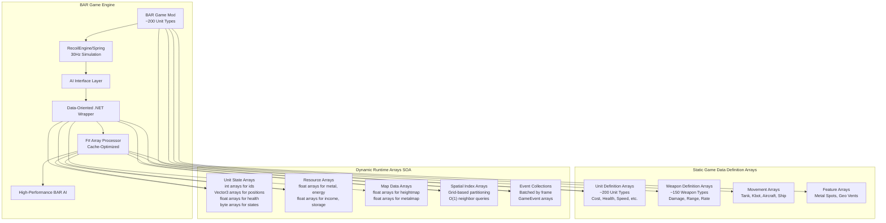
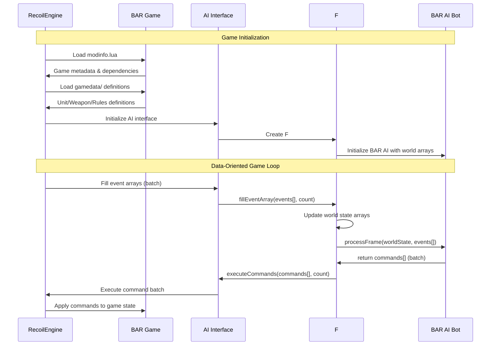

# Beyond All Reason (BAR) Integration for Data-Oriented AI

## Overview

Beyond All Reason (BAR) is a complete Real-Time Strategy game built on top of the RecoilEngine (Spring). This document details how BAR integrates with our **data-oriented .NET AI wrapper**, focusing on efficient, array-based processing of BAR's extensive unit and game data for high-performance AI development.

## BAR Data-Oriented Architecture



## High-Performance Data Access Patterns

### Structure-of-Arrays (SOA) for Cache Optimization

BAR AI performance is critical due to high unit counts. Our wrapper uses SOA layout:

```fsharp
// Traditional AOS (Array of Structures) - Poor cache performance
type Unit = { Id: int; Position: Vector3; Health: float32; MaxHealth: float32 }
let units: Unit[] = [| ... |]  // Scattered memory access

// Data-Oriented SOA (Structure of Arrays) - Optimal cache performance  
type WorldState = {
    UnitIds: int[]           // All unit IDs together
    UnitPositions: Vector3[] // All positions together
    UnitHealth: float32[]    // All health values together
    UnitMaxHealth: float32[] // All max health values together
    UnitDefIds: int16[]      // Compact unit type IDs
    UnitStates: byte[]       // Packed state flags
}
```

### Efficient BAR Unit Processing

```fsharp
/// Process all units efficiently using array operations
let processAllUnitsHealth (worldState: WorldState) : (int * float32)[] =
    // Calculate health percentages for all units in parallel
    Array.map2 (fun health maxHealth -> 
        if maxHealth > 0.0f then health / maxHealth else 0.0f
    ) worldState.UnitHealth worldState.UnitMaxHealth
    |> Array.zip worldState.UnitIds
    |> Array.filter (fun (_, healthPercent) -> healthPercent < 0.3f) // Critical units

/// Find nearby enemies using spatial grid
let findNearbyEnemies (spatialGrid: SpatialGrid) (position: Vector3) (radius: float32) : int[] =
    // O(1) spatial lookup instead of O(n) linear search
    let cellX = int (position.X / float32 spatialGrid.CellSize)
    let cellZ = int (position.Z / float32 spatialGrid.CellSize)
    let cellRadius = int (radius / float32 spatialGrid.CellSize) + 1
    
    [| for x in cellX - cellRadius .. cellX + cellRadius do
       for z in cellZ - cellRadius .. cellZ + cellRadius do
           let cellIndex = z * spatialGrid.GridSize + x
           if cellIndex >= 0 && cellIndex < spatialGrid.UnitCells.Length then
               yield! spatialGrid.UnitCells.[cellIndex] |]
```

## BAR Game Content Structure for AI Access

### Optimized Directory Layout for Data Loading



## BAR Data Storage and Access Mechanisms

### Where BAR Information is Stored

BAR-specific game data is stored in multiple locations within the game directory structure and is processed through several layers before reaching the .NET AI wrapper:

#### 1. Static Game Definition Files

**Location**: `BAR.sdd/` (game archive)
```
BAR.sdd/
├── units/                        # Lua unit definition files
│   ├── armcom.lua               # ARM Commander definition
│   ├── armsolar.lua             # ARM Solar Collector definition
│   └── [unit_name].lua          # Pattern for all units
├── weapons/                      # Lua weapon definition files
│   ├── armcom_weapon.lua        # Commander weapons
│   └── [weapon_name].lua        # Pattern for all weapons
├── gamedata/                     # Core game rules and constants
│   ├── alldefs.lua              # Global definitions
│   ├── armordefs.lua            # Armor type definitions
│   └── movedefs.lua             # Movement type definitions
├── luarules/                     # Server-side game logic
│   ├── gadgets/                 # Game mechanics (Lua)
│   └── configs/                 # Configuration files
└── modinfo.lua                   # Game metadata and engine requirements
```

**Data Format**: All stored as Lua tables with typed properties
```lua
-- Example: armcom.lua (ARM Commander)
local unitDef = {
    name = "ARM Commander",
    description = "Commander",
    acceleration = 0.18,
    activateWhenBuilt = true,
    buildCostMetal = 2500,
    buildCostEnergy = 25000,
    buildTime = 30000,
    canAttack = true,
    canGuard = true,
    canMove = true,
    canPatrol = true,
    category = "ALL COMMANDER MOBILE WEAPON SURFACE",
    corpse = "ARMCOM_DEAD",
    explodeAs = "COMMANDER_BLAST",
    footprintX = 2,
    footprintZ = 2,
    health = 3000,
    maxDamage = 3000,
    -- ... hundreds more properties
}
```

#### 2. Runtime Engine Processing

**When Accessed**: During game initialization and runtime
```cpp
// Engine processes Lua definitions into C++ structures
struct UnitDef {
    int id;                    // Unique unit definition ID
    std::string name;          // Human readable name
    std::string filename;      // Internal filename
    float metalCost;           // Metal cost to build
    float energyCost;          // Energy cost to build
    float health;              // Maximum hit points
    std::vector<std::string> categories; // Category strings
    // ... 200+ more fields
};
```

#### 3. AI Interface Layer Translation

**How Information Flows**: Lua → C++ Engine → C AI Interface → .NET P/Invoke → C# Objects

```cpp
// C AI Interface (ExternalAI/Interface/)
typedef struct {
    int unitDefId;
    const char* name;
    const char* filename;
    float metalCost;
    float energyCost;
    float maxHealth;
    // Simplified structure for AI consumption
} SAIUnitDef;
```

### .NET Wrapper Data Access Patterns

#### 1. P/Invoke Layer (Interop/NativeMethods.cs)

**String Handling**: BAR uses UTF-8 strings passed via C interface
```csharp
[DllImport("SpringAIWrapper", CallingConvention = CallingConvention.Cdecl)]
private static extern IntPtr GetUnitDefName(int unitDefId);

[DllImport("SpringAIWrapper", CallingConvention = CallingConvention.Cdecl)]
private static extern IntPtr GetUnitDefCategories(int unitDefId, out int count);

// String marshaling with proper UTF-8 handling
public static string GetUnitName(int unitDefId)
{
    IntPtr ptr = GetUnitDefName(unitDefId);
    return ptr != IntPtr.Zero ? Marshal.PtrToStringUTF8(ptr) : string.Empty;
}
```

#### 2. Typed .NET Objects (Auto-Generated from Engine Data)

**No Manual String Parsing**: Categories are pre-processed by engine
```csharp
public class UnitDefinition
{
    public int Id { get; internal set; }
    public string Name { get; internal set; }           // "ARM Commander"
    public string DefName { get; internal set; }        // "armcom"
    public float MetalCost { get; internal set; }       // 2500.0f
    public float EnergyCost { get; internal set; }      // 25000.0f
    public float MaxHealth { get; internal set; }       // 3000.0f
    
    // Categories converted from Lua string to .NET collection
    public IReadOnlyList<string> Categories { get; internal set; }  
    // ["ALL", "COMMANDER", "MOBILE", "WEAPON", "SURFACE"]
    
    // BAR-specific faction detection (derived from defName)
    public BARFaction Faction => DefName.StartsWith("arm") ? BARFaction.ARM 
                               : DefName.StartsWith("cor") ? BARFaction.COR 
                               : BARFaction.Unknown;
}
```

#### 3. BAR-Specific Data Enrichment

**Runtime Enhancement**: .NET wrapper adds BAR-specific intelligence
```csharp
public static class BARExtensions
{
    // BAR-specific unit classification
    public static BARUnitType GetBARUnitType(this UnitDefinition unitDef)
    {
        var categories = unitDef.Categories;
        
        if (categories.Contains("COMMANDER")) return BARUnitType.Commander;
        if (categories.Contains("BUILDER")) return BARUnitType.Builder;
        if (categories.Contains("FACTORY")) return BARUnitType.Factory;
        if (categories.Contains("WEAPON") && categories.Contains("MOBILE")) 
            return BARUnitType.MobileWeapon;
        if (categories.Contains("ENERGY")) return BARUnitType.EnergyProducer;
        if (categories.Contains("METAL")) return BARUnitType.MetalExtractor;
        
        return BARUnitType.Unknown;
    }
    
    // BAR build tree analysis
    public static IEnumerable<string> GetBuildOptions(this UnitDefinition unitDef, IGameCallback callback)
    {
        // Query engine for build options (cached for performance)
        return callback.GetUnitDefBuildOptions(unitDef.Id);
    }
}
```

### Data Access Timing and Performance

#### 1. Initialization Phase (Game Start)
```csharp
public override void OnInit(int skirmishAIId, bool savedGame)
{
    // Pre-cache all unit definitions (expensive, done once)
    _unitDefinitions = new Dictionary<int, UnitDefinition>();
    
    int unitDefCount = Callback.GetUnitDefCount();
    for (int i = 0; i < unitDefCount; i++)
    {
        var unitDef = Callback.GetUnitDef(i);
        _unitDefinitions[unitDef.Id] = unitDef;
        
        // BAR-specific preprocessing
        if (unitDef.GetBARUnitType() == BARUnitType.Factory)
        {
            _factoryTypes.Add(unitDef.DefName, unitDef.GetBuildOptions(Callback));
        }
    }
}
```

#### 2. Runtime Access (Per-Frame Operations)
```csharp
public override void OnUpdate(int frame)
{
    // Fast lookup - no string parsing at runtime
    var myUnits = Callback.GetFriendlyUnits();
    foreach (var unit in myUnits)
    {
        // O(1) lookup using cached definitions
        var unitDef = _unitDefinitions[unit.DefId];
        
        // BAR-specific decision making using typed data
        switch (unitDef.GetBARUnitType())
        {
            case BARUnitType.Commander:
                HandleCommander(unit, unitDef);
                break;
            case BARUnitType.Factory:
                ManageProduction(unit, unitDef);
                break;
            // ... other cases
        }
    }
}
```

### BAR-Specific Information Types

#### 1. Unit Metadata (From Lua Definitions)
- **Faction**: Derived from unit definition name prefix (`arm*`, `cor*`)
- **Tech Level**: Derived from advanced vs basic building requirements
- **Economic Data**: Metal/Energy costs, build time, resource production rates
- **Combat Data**: Weapon definitions, armor types, movement capabilities
- **Build Dependencies**: What buildings are required to construct this unit

#### 2. Dynamic Game State (From Engine Events)
- **Resource Flow**: Current metal/energy income and storage
- **Map Information**: Metal spots, geographical features, choke points  
- **Unit Status**: Health, experience level, current orders, ammunition
- **Team Relations**: Allied/enemy status, shared resources, communication

#### 3. BAR Game Rules (From luarules/)
- **Economic Rules**: Overdrive, metal extraction efficiency, energy conversion
- **Combat Rules**: Damage types, armor effectiveness, weapon ranges
- **Construction Rules**: Build restrictions, terraform limitations, unit limits

### Error Handling and Validation

#### 1. Data Integrity Checks
```csharp
public class SafeGameDataAccess
{
    public static UnitDefinition GetValidatedUnitDef(IGameCallback callback, int unitDefId)
    {
        try
        {
            var unitDef = callback.GetUnitDef(unitDefId);
            if (unitDef == null)
                throw new InvalidDataException($"Unit definition {unitDefId} not found");
                
            if (string.IsNullOrEmpty(unitDef.Name))
                throw new InvalidDataException($"Unit definition {unitDefId} has no name");
                
            return unitDef;
        }
        catch (Exception ex)
        {
            Logger.LogWarning($"Failed to get unit definition {unitDefId}: {ex.Message}");
            return CreateFallbackUnitDef(unitDefId);
        }
    }
}
```

#### 2. BAR Version Compatibility
```csharp
public class BARVersionDetection
{
    public static BARVersion DetectBARVersion(IGameCallback callback)
    {
        var modInfo = callback.GetModInfo();
        
        // Parse version from mod information
        if (modInfo.Name.Contains("Beyond All Reason"))
        {
            var versionMatch = Regex.Match(modInfo.Version, @"(\d+)\.(\d+)\.(\d+)");
            if (versionMatch.Success)
            {
                return new BARVersion(
                    int.Parse(versionMatch.Groups[1].Value),
                    int.Parse(versionMatch.Groups[2].Value),
                    int.Parse(versionMatch.Groups[3].Value)
                );
            }
        }
        
        throw new UnsupportedModException("This AI requires Beyond All Reason");
    }
}
```

## BAR-Specific Data Integration

### Unit Definition System

BAR extends the Spring engine unit system with comprehensive definitions:

#### Unit Categories
BAR organizes units into hierarchical categories:

```lua
-- Example BAR unit categories
categories = {
    -- Faction
    "ARM", "COR",           -- Primary factions
    
    -- Unit Type
    "TANK", "KBOT", "AIRCRAFT", "SHIP", "BUILDING",
    
    -- Role
    "COMMANDER", "BUILDER", "FACTORY", "WEAPON", "ENERGY", "METAL",
    
    -- Capabilities  
    "CANATTACK", "CANMOVE", "CANBUILD", "CANFLY", "CANSWIM"
}
```

#### Accessing Unit Information via AI Interface

```csharp
// .NET AI Implementation accessing BAR unit data
public class BARUnitAnalyzer 
{
    public void AnalyzeUnit(int unitId)
    {
        // Get unit definition ID
        var unitDefId = Callback.GetUnitDefId(unitId);
        
        // Access BAR-specific unit properties through engine interface
        var unitName = Callback.GetUnitDefName(unitDefId);        // e.g., "armcom"
        var categories = Callback.GetUnitCategories(unitDefId);   // e.g., "ARM COMMANDER CANATTACK"
        var buildOptions = Callback.GetUnitBuildOptions(unitDefId);
        
        // BAR faction detection
        bool isARM = categories.Contains("ARM");
        bool isCOR = categories.Contains("COR");
        
        // BAR role detection
        bool isCommander = categories.Contains("COMMANDER");
        bool isBuilder = categories.Contains("BUILDER");
        bool isFactory = categories.Contains("FACTORY");
        
        // Use BAR-specific logic
        if (isCommander) {
            HandleCommanderUnit(unitId, unitDefId);
        } else if (isFactory) {
            HandleFactoryUnit(unitId, unitDefId, buildOptions);
        }
    }
}
```

### Weapon System Integration

BAR has an extensive weapon system accessible through the standard interface:

```csharp
public class BARWeaponAnalyzer
{
    public void AnalyzeWeapons(int unitDefId)
    {
        // Get weapon definitions through engine interface
        var weaponCount = Callback.GetUnitWeaponCount(unitDefId);
        
        for (int i = 0; i < weaponCount; i++) {
            var weaponDefId = Callback.GetUnitWeapon(unitDefId, i);
            var weaponName = Callback.GetWeaponDefName(weaponDefId);
            var damage = Callback.GetWeaponDamage(weaponDefId);
            var range = Callback.GetWeaponRange(weaponDefId);
            var weaponType = Callback.GetWeaponType(weaponDefId);
            
            // BAR-specific weapon analysis
            if (weaponName.Contains("disintegrator")) {
                // Handle D-Gun weapons
                ConfigureCommanderWeapon(unitDefId, weaponDefId);
            } else if (weaponType == "BeamLaser") {
                // Handle laser weapons common in BAR
                ConfigureLaserWeapon(unitDefId, weaponDefId);
            }
        }
    }
}
```

### Economy System Access

BAR uses the standard Spring economy but with specific balance:

```csharp
public class BAREconomyManager
{
    public void ManageResources()
    {
        // Standard Spring economy interface works with BAR
        float metal = Callback.GetMetal();
        float energy = Callback.GetEnergy();
        float metalIncome = Callback.GetMetalIncome();
        float energyIncome = Callback.GetEnergyIncome();
        
        // BAR-specific economic strategies
        float metalRatio = metal / Callback.GetMetalStorage();
        float energyRatio = energy / Callback.GetEnergyStorage();
        
        if (metalRatio < 0.2f) {
            // Build metal extractors or reclaimers
            BuildMetalProduction();
        }
        
        if (energyRatio < 0.3f) {
            // Build energy production (solar/wind/geo)
            BuildEnergyProduction();
        }
    }
}
```

## BAR Game Rules and ModOptions

### ModOptions Integration

BAR provides extensive customization through mod options:

```lua
-- Example BAR modoptions.lua structure
local options = {
    {
        key = "startmetal",
        name = "Starting Metal",
        desc = "Initial metal amount for each player",
        type = "number",
        def = 1000,
        min = 0,
        max = 10000
    },
    {
        key = "difficulty",
        name = "AI Difficulty",
        desc = "Difficulty level for AI opponents",
        type = "list",
        def = "Normal",
        items = {"Easy", "Normal", "Hard", "Brutal"}
    }
}
```

Accessing mod options in AI:

```csharp
public class BARGameConfiguration
{
    public void ReadGameSettings()
    {
        // Access mod options through engine interface
        var modOptions = Callback.GetModOptions();
        
        int startMetal = int.Parse(modOptions.GetValueOrDefault("startmetal", "1000"));
        string difficulty = modOptions.GetValueOrDefault("difficulty", "Normal");
        
        // Adapt AI strategy based on game settings
        if (difficulty == "Brutal") {
            aggressionLevel = 1.5f;
            economicFocus = 0.8f;
        }
        
        // Use starting metal information for early game strategy
        if (startMetal > 2000) {
            enableRushStrategy = true;
        }
    }
}
```

### Game Rules Access

BAR customizes engine behavior through modrules:

```csharp
public class BARGameRules
{
    public void InitializeGameRules()
    {
        // Engine exposes mod rules through standard interface
        bool constructionDecay = Callback.GetModRule("constructionDecay");
        float reclaimSpeed = Callback.GetModRuleFloat("reclaimSpeed");
        int maxUnits = Callback.GetModRuleInt("maxUnits");
        
        // Adapt AI behavior to game rules
        if (constructionDecay) {
            // Prioritize faster construction completion
            builderAllocationStrategy = BuilderStrategy.FastCompletion;
        }
        
        if (maxUnits < 500) {
            // Focus on quality over quantity
            unitProductionStrategy = ProductionStrategy.Elite;
        }
    }
}
```

## BAR Unit Identification Patterns

### Faction Detection

```csharp
public enum BARFaction { ARM, COR, Unknown }

public class BARUnitClassifier
{
    public BARFaction IdentifyFaction(int unitDefId)
    {
        string unitName = Callback.GetUnitDefName(unitDefId);
        string categories = Callback.GetUnitCategories(unitDefId);
        
        // BAR naming conventions
        if (unitName.StartsWith("arm") || categories.Contains("ARM")) {
            return BARFaction.ARM;
        } else if (unitName.StartsWith("cor") || categories.Contains("COR")) {
            return BARFaction.COR;
        }
        
        return BARFaction.Unknown;
    }
    
    public BARUnitRole ClassifyRole(int unitDefId)
    {
        string categories = Callback.GetUnitCategories(unitDefId);
        
        if (categories.Contains("COMMANDER")) return BARUnitRole.Commander;
        if (categories.Contains("BUILDER")) return BARUnitRole.Builder;
        if (categories.Contains("FACTORY")) return BARUnitRole.Factory;
        if (categories.Contains("WEAPON")) return BARUnitRole.Combat;
        if (categories.Contains("ENERGY")) return BARUnitRole.Energy;
        if (categories.Contains("METAL")) return BARUnitRole.Metal;
        
        return BARUnitRole.Unknown;
    }
}
```

### Build Order Management

```csharp
public class BARBuildOrderManager
{
    public void DetermineOptimalBuildOrder()
    {
        var faction = IdentifyPlayerFaction();
        
        switch (faction) {
            case BARFaction.ARM:
                // ARM typically has stronger economy early game
                buildOrder = new[] {
                    "armsolar",    // Solar panel
                    "armkbot",     // Construction kbot
                    "armvp",       // Kbot factory
                    "armrock"      // Rocket kbot
                };
                break;
                
            case BARFaction.COR:
                // COR typically focuses on heavy units
                buildOrder = new[] {
                    "corsolar",    // Solar panel
                    "corveh",      // Construction vehicle
                    "corvp",       // Vehicle factory
                    "corraid"      // Raider tank
                };
                break;
        }
    }
}
```

## Map Integration

### BAR Map Features

BAR maps contain specific features accessible through the engine:

```csharp
public class BARMapAnalyzer
{
    public void AnalyzeMap()
    {
        // Standard Spring map interface works with BAR maps
        int mapWidth = Callback.GetMapWidth();
        int mapHeight = Callback.GetMapHeight();
        
        // Analyze metal spots (crucial for BAR economy)
        var metalSpots = Callback.GetMetalSpots();
        foreach (var spot in metalSpots) {
            float metalDensity = spot.MetalAmount;
            Vector3 position = spot.Position;
            
            // Plan metal extractor placement
            if (metalDensity > 1.5f) {
                PlanMetalExtractor(position, "high_priority");
            }
        }
        
        // Analyze strategic positions
        var startPositions = Callback.GetStartPositions();
        var geothermalVents = Callback.GetGeothermalFeatures();
        
        // BAR-specific map strategy
        if (geothermalVents.Any()) {
            PlanGeothermalExpansion(geothermalVents);
        }
    }
}
```

## AI Interface Extensions for BAR

### Custom BAR Event Handlers

```csharp
public class BARSpecificAI : BaseAI
{
    private BARUnitClassifier unitClassifier;
    private BAREconomyManager economyManager;
    private BARBuildOrderManager buildManager;
    
    public override void OnInit(int skirmishAIId, bool savedGame)
    {
        base.OnInit(skirmishAIId, savedGame);
        
        unitClassifier = new BARUnitClassifier();
        economyManager = new BAREconomyManager();
        buildManager = new BARBuildOrderManager();
        
        // Initialize BAR-specific systems
        InitializeBARGameRules();
        AnalyzeBARMap();
        DetermineBARStrategy();
    }
    
    public override void OnUnitCreated(int unitId, int builderId)
    {
        base.OnUnitCreated(unitId, builderId);
        
        // BAR-specific unit handling
        var unitDefId = Callback.GetUnitDefId(unitId);
        var faction = unitClassifier.IdentifyFaction(unitDefId);
        var role = unitClassifier.ClassifyRole(unitDefId);
        
        switch (role) {
            case BARUnitRole.Commander:
                HandleCommanderCreated(unitId, faction);
                break;
            case BARUnitRole.Factory:
                RegisterFactory(unitId, faction);
                break;
            case BARUnitRole.Builder:
                AssignBuilderToQueue(unitId);
                break;
        }
    }
    
    public override void OnUnitDamaged(int unitId, int attackerId, float damage, Vector3 direction, int weaponDefId, bool paralyzer)
    {
        base.OnUnitDamaged(unitId, attackerId, damage, direction, weaponDefId, paralyzer);
        
        // BAR-specific damage response
        var unitDefId = Callback.GetUnitDefId(unitId);
        if (unitClassifier.ClassifyRole(unitDefId) == BARUnitRole.Commander) {
            // Commander under attack - emergency response
            ImplementCommanderDefense(unitId, attackerId);
        }
    }
}
```

## Performance Considerations

### Efficient BAR Data Access

```csharp
public class BARDataCache
{
    private Dictionary<int, BARUnitInfo> unitCache = new();
    private Dictionary<string, int> unitNameToDefId = new();
    
    public BARUnitInfo GetUnitInfo(int unitDefId)
    {
        if (!unitCache.ContainsKey(unitDefId)) {
            // Cache BAR unit information for performance
            unitCache[unitDefId] = new BARUnitInfo {
                Name = Callback.GetUnitDefName(unitDefId),
                Faction = DetermineFaction(unitDefId),
                Role = DetermineRole(unitDefId),
                BuildOptions = Callback.GetUnitBuildOptions(unitDefId),
                Categories = Callback.GetUnitCategories(unitDefId)
            };
        }
        
        return unitCache[unitDefId];
    }
}
```

## Conclusion

BAR integrates seamlessly with the RecoilEngine AI interface while providing rich game content and mechanics. AI implementations can:

1. **Access BAR content** through standard Spring engine callbacks
2. **Identify BAR-specific units** using naming conventions and categories  
3. **Utilize BAR game rules** through mod options and game state queries
4. **Implement BAR strategies** using faction-specific knowledge and unit roles
5. **Optimize for BAR gameplay** through caching and efficient data access patterns

The .NET wrapper provides a clean, strongly-typed interface to all BAR functionality while maintaining compatibility with the underlying Spring engine architecture. This allows AI developers to focus on strategy implementation rather than low-level engine integration.
