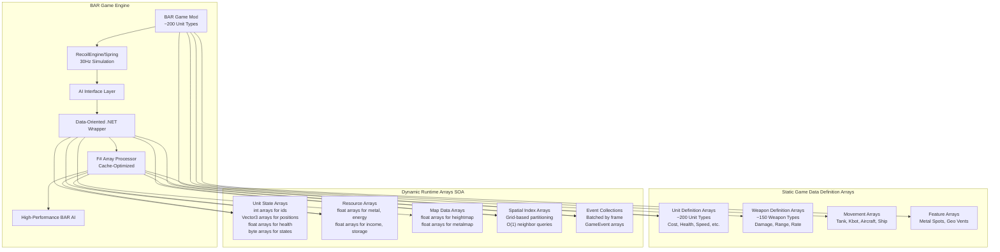
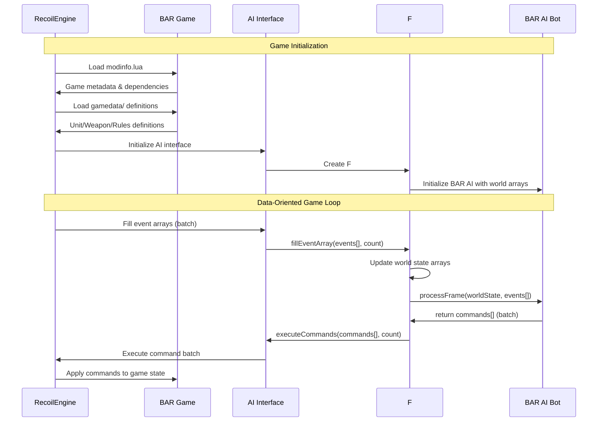

# Beyond All Reason (BAR) Integration for Data-Oriented AI

## Overview

Beyond All Reason (BAR) is a complete Real-Time Strategy game built on top of the RecoilEngine (Spring). This document details how BAR integrates with our **data-oriented .NET AI wrapper**, focusing on efficient, array-based processing of BAR's extensive unit and game data for high-performance AI development.

## BAR Data-Oriented Architecture



## High-Performance Data Access Patterns

### Structure-of-Arrays (SOA) for Cache Optimization

BAR AI performance is critical due to high unit counts. Our wrapper uses SOA layout:

```fsharp
// Traditional AOS (Array of Structures) - Poor cache performance
type Unit = { Id: int; Position: Vector3; Health: float32; MaxHealth: float32 }
let units: Unit[] = [| ... |]  // Scattered memory access

// Data-Oriented SOA (Structure of Arrays) - Optimal cache performance  
type WorldState = {
    UnitIds: int[]           // All unit IDs together
    UnitPositions: Vector3[] // All positions together
    UnitHealth: float32[]    // All health values together
    UnitMaxHealth: float32[] // All max health values together
    UnitDefIds: int16[]      // Compact unit type IDs
    UnitStates: byte[]       // Packed state flags
}
```

### Efficient BAR Unit Processing

```fsharp
/// Process all units efficiently using array operations
let processAllUnitsHealth (worldState: WorldState) : (int * float32)[] =
    // Calculate health percentages for all units in parallel
    Array.map2 (fun health maxHealth -> 
        if maxHealth > 0.0f then health / maxHealth else 0.0f
    ) worldState.UnitHealth worldState.UnitMaxHealth
    |> Array.zip worldState.UnitIds
    |> Array.filter (fun (_, healthPercent) -> healthPercent < 0.3f) // Critical units

/// Find nearby enemies using spatial grid
let findNearbyEnemies (spatialGrid: SpatialGrid) (position: Vector3) (radius: float32) : int[] =
    // O(1) spatial lookup instead of O(n) linear search
    let cellX = int (position.X / float32 spatialGrid.CellSize)
    let cellZ = int (position.Z / float32 spatialGrid.CellSize)
    let cellRadius = int (radius / float32 spatialGrid.CellSize) + 1
    
    [| for x in cellX - cellRadius .. cellX + cellRadius do
       for z in cellZ - cellRadius .. cellZ + cellRadius do
           let cellIndex = z * spatialGrid.GridSize + x
           if cellIndex >= 0 && cellIndex < spatialGrid.UnitCells.Length then
               yield! spatialGrid.UnitCells.[cellIndex] |]
```

## BAR Game Content Structure for AI Access

### Optimized Directory Layout for Data Loading



## BAR Data Storage and Access Mechanisms

### Where BAR Information is Stored

BAR-specific game data is stored in multiple locations within the game directory structure and is processed through several layers before reaching the .NET AI wrapper:

#### 1. Static Game Definition Files

**Location**: `BAR.sdd/` (game archive)
```
BAR.sdd/
├── units/                        # Lua unit definition files
│   ├── armcom.lua               # ARM Commander definition
│   ├── armsolar.lua             # ARM Solar Collector definition
│   └── [unit_name].lua          # Pattern for all units
├── weapons/                      # Lua weapon definition files
│   ├── armcom_weapon.lua        # Commander weapons
│   └── [weapon_name].lua        # Pattern for all weapons
├── gamedata/                     # Core game rules and constants
│   ├── alldefs.lua              # Global definitions
│   ├── armordefs.lua            # Armor type definitions
│   └── movedefs.lua             # Movement type definitions
├── luarules/                     # Server-side game logic
│   ├── gadgets/                 # Game mechanics (Lua)
│   └── configs/                 # Configuration files
└── modinfo.lua                   # Game metadata and engine requirements
```

**Data Format**: All stored as Lua tables with typed properties
```lua
-- Example: armcom.lua (ARM Commander)
local unitDef = {
    name = "ARM Commander",
    description = "Commander",
    acceleration = 0.18,
    activateWhenBuilt = true,
    buildCostMetal = 2500,
    buildCostEnergy = 25000,
    buildTime = 30000,
    canAttack = true,
    canGuard = true,
    canMove = true,
    canPatrol = true,
    category = "ALL COMMANDER MOBILE WEAPON SURFACE",
    corpse = "ARMCOM_DEAD",
    explodeAs = "COMMANDER_BLAST",
    footprintX = 2,
    footprintZ = 2,
    health = 3000,
    maxDamage = 3000,
    -- ... hundreds more properties
}
```

#### 2. Runtime Engine Processing

**When Accessed**: During game initialization and runtime
```cpp
// Engine processes Lua definitions into C++ structures
struct UnitDef {
    int id;                    // Unique unit definition ID
    std::string name;          // Human readable name
    std::string filename;      // Internal filename
    float metalCost;           // Metal cost to build
    float energyCost;          // Energy cost to build
    float health;              // Maximum hit points
    std::vector<std::string> categories; // Category strings
    // ... 200+ more fields
};
```

#### 3. AI Interface Layer Translation

**How Information Flows**: Lua → C++ Engine → C AI Interface → .NET P/Invoke → C# Objects

```cpp
// C AI Interface (ExternalAI/Interface/)
typedef struct {
    int unitDefId;
    const char* name;
    const char* filename;
    float metalCost;
    float energyCost;
    float maxHealth;
    // Simplified structure for AI consumption
} SAIUnitDef;
```

### F# Wrapper Data Access Patterns

#### 1. P/Invoke Layer (Interop.fs)

**String Handling**: BAR uses UTF-8 strings passed via C interface
```fsharp
open System
open System.Runtime.InteropServices

[<DllImport("SpringAIWrapper", CallingConvention = CallingConvention.Cdecl)>]
extern nativeint GetUnitDefName(int unitDefId)

[<DllImport("SpringAIWrapper", CallingConvention = CallingConvention.Cdecl)>]
extern nativeint GetUnitDefCategories(int unitDefId, int& count)

// String marshaling with proper UTF-8 handling
let getUnitName (unitDefId: int) : string =
    let ptr = GetUnitDefName(unitDefId)
    if ptr <> nativeint 0 then
        Marshal.PtrToStringUTF8(ptr)
    else
        String.Empty
```

#### 2. F# Record Types (Data-Oriented Structures)

**Immutable Records**: Categories are pre-processed by engine
```fsharp
type UnitDefinition = {
    Id: int
    Name: string                    // "ARM Commander"
    DefName: string                 // "armcom"
    MetalCost: float32<metal>       // 2500.0f with units of measure
    EnergyCost: float32<energy>     // 25000.0f with units of measure
    MaxHealth: float32<health>      // 3000.0f with units of measure
    
    // Categories as immutable array
    Categories: string[]            // [|"ALL"; "COMMANDER"; "MOBILE"; "WEAPON"; "SURFACE"|]
    
    // BAR-specific faction detection (computed property)
    Faction: BARFaction
}

and BARFaction = ARM | COR | Unknown

// Pure function for faction detection
let getFaction (defName: string) =
    if defName.StartsWith("arm") then ARM
    elif defName.StartsWith("cor") then COR
    else Unknown
```

#### 3. BAR-Specific Data Enrichment

**Pure Functions**: F# wrapper adds BAR-specific intelligence through pure functions
```fsharp
module BARExtensions =
    // BAR-specific unit classification
    let getBARUnitType (unitDef: UnitDefinition) : BARUnitType =
        var categories = unitDef.Categories;        
        match unitDef.Categories with
        | cats when Array.contains "COMMANDER" cats -> BARUnitType.Commander
        | cats when Array.contains "BUILDER" cats -> BARUnitType.Builder
        | cats when Array.contains "FACTORY" cats -> BARUnitType.Factory
        | cats when Array.contains "WEAPON" cats && Array.contains "MOBILE" cats -> 
            BARUnitType.MobileWeapon
        | cats when Array.contains "ENERGY" cats -> BARUnitType.EnergyProducer
        | cats when Array.contains "METAL" cats -> BARUnitType.MetalExtractor
        | _ -> BARUnitType.Unknown
    
    // BAR build tree analysis using pure functions
    let getBuildOptions (unitDef: UnitDefinition) (worldState: WorldState) : string[] =
        // Query world state for build options (immutable lookup)
        worldState.UnitDefBuildOptions.[unitDef.Id]
```

### Data Access Timing and Performance

#### 1. Initialization Phase (Game Start)
```fsharp
let initializeAI (skirmishAIId: int) (savedGame: bool) =
{    // Pre-cache all unit definitions in immutable array (expensive, done once)
    let unitDefCount = getUnitDefCount()
    
    let unitDefinitions = 
        [| 0 .. unitDefCount - 1 |]
        |> Array.map getUnitDef
        
    // BAR-specific preprocessing using pure functions
    let factoryTypes = 
        unitDefinitions
        |> Array.filter (fun unitDef -> getBARUnitType unitDef = BARUnitType.Factory)
        |> Array.map (fun unitDef -> unitDef.DefName, getBuildOptions unitDef)
        |> Map.ofArray
        
    // Create initial world state
    { UnitDefinitions = unitDefinitions; FactoryTypes = factoryTypes }
}
```

#### 2. Runtime Access (Per-Frame Operations)
```csharp
public override void OnUpdate(int frame)
{
    // Fast lookup - no string parsing at runtime
    var myUnits = Callback.GetFriendlyUnits();
    foreach (var unit in myUnits)
    {
        // O(1) lookup using cached definitions
        var unitDef = _unitDefinitions[unit.DefId];        
        // BAR-specific decision making using pattern matching
        match getBARUnitType unitDef with
        | BARUnitType.Commander ->
            handleCommander unit unitDef worldState
        | BARUnitType.Factory ->
            manageProduction unit unitDef worldState
        | _ -> 
            [||] // No commands for other unit types
    )
```

### BAR-Specific Information Types

#### 1. Unit Metadata (From Lua Definitions)
- **Faction**: Derived from unit definition name prefix (`arm*`, `cor*`)
- **Tech Level**: Derived from advanced vs basic building requirements
- **Economic Data**: Metal/Energy costs, build time, resource production rates
- **Combat Data**: Weapon definitions, armor types, movement capabilities
- **Build Dependencies**: What buildings are required to construct this unit

#### 2. Dynamic Game State (From Engine Events)
- **Resource Flow**: Current metal/energy income and storage
- **Map Information**: Metal spots, geographical features, choke points  
- **Unit Status**: Health, experience level, current orders, ammunition
- **Team Relations**: Allied/enemy status, shared resources, communication

#### 3. BAR Game Rules (From luarules/)
- **Economic Rules**: Overdrive, metal extraction efficiency, energy conversion
- **Combat Rules**: Damage types, armor effectiveness, weapon ranges
- **Construction Rules**: Build restrictions, terraform limitations, unit limits

### Error Handling and Validation

#### 1. Data Integrity Checks
```csharp
public class SafeGameDataAccess
{
    public static UnitDefinition GetValidatedUnitDef(IGameCallback callback, int unitDefId)
    {
        try        match tryGetUnitDef unitDefId with
        | Some unitDef when not (String.IsNullOrEmpty unitDef.Name) ->
            unitDef
        | Some _ ->
            failwithf "Unit definition %d has no name" unitDefId
        | None ->
            failwithf "Unit definition %d not found" unitDefId
    with
    | ex ->
        logWarning (sprintf "Failed to get unit definition %d: %s" unitDefId ex.Message)
        createFallbackUnitDef unitDefId
```

#### 2. BAR Version Compatibility
```fsharp
module BARVersionDetection =
    
    type BARVersion = { Major: int; Minor: int; Patch: int }
    
    let detectBARVersion (modInfo: ModInfo) : Result<BARVersion, string> =
        if modInfo.Name.Contains("Beyond All Reason") then
            let versionPattern = @"(\d+)\.(\d+)\.(\d+)"
            let versionMatch = Regex.Match(modInfo.Version, versionPattern)
            
            if versionMatch.Success then
                Ok {
                    Major = int versionMatch.Groups.[1].Value
                    Minor = int versionMatch.Groups.[2].Value
                    Patch = int versionMatch.Groups.[3].Value
                }
            else
                Error "Could not parse BAR version"
        else
            Error "This AI requires Beyond All Reason"
```

## BAR-Specific Data Integration

### Unit Definition System

BAR extends the Spring engine unit system with comprehensive definitions:

#### Unit Categories
BAR organizes units into hierarchical categories:

```lua
-- Example BAR unit categories
categories = {
    -- Faction
    "ARM", "COR",           -- Primary factions
    
    -- Unit Type
    "TANK", "KBOT", "AIRCRAFT", "SHIP", "BUILDING",
    
    -- Role
    "COMMANDER", "BUILDER", "FACTORY", "WEAPON", "ENERGY", "METAL",
    
    -- Capabilities  
    "CANATTACK", "CANMOVE", "CANBUILD", "CANFLY", "CANSWIM"
}
```

#### Accessing Unit Information via AI Interface

```fsharp
// F# AI Implementation accessing BAR unit data
module BARUnitAnalyzer =
    
    let analyzeUnit (unitId: int) (worldState: WorldState) : UnitAnalysis =
        // Get unit definition ID from world state arrays
        let unitDefId = worldState.Units.[unitId].DefId
        let unitDef = worldState.UnitDefinitions.[unitDefId]
        
        // Access BAR-specific unit properties through immutable data
        let unitName = unitDef.DefName                    // e.g., "armcom"
        let categories = unitDef.Categories               // e.g., [|"ARM"; "COMMANDER"; "CANATTACK"|]
        let buildOptions = worldState.UnitDefBuildOptions.[unitDefId]
        
        // BAR faction detection using pattern matching
        let faction = 
            match categories with
            | cats when Array.contains "ARM" cats -> ARM
            | cats when Array.contains "COR" cats -> COR
            | _ -> Unknown
        
        // BAR role detection using active patterns
        let role = 
            match categories with
            | cats when Array.contains "COMMANDER" cats -> Commander
            | cats when Array.contains "BUILDER" cats -> Builder
            | cats when Array.contains "FACTORY" cats -> Factory
            | _ -> Generic
        
        // Use BAR-specific logic with pattern matching
        match role with
        | Commander -> 
            handleCommanderUnit unitId unitDef worldState
        | Factory -> 
            handleFactoryUnit unitId unitDef buildOptions worldState        | _ -> 
            handleGenericUnit unitId unitDef worldState
```

### Weapon System Integration

BAR has an extensive weapon system accessible through immutable data structures:

```fsharp
module BARWeaponAnalyzer =
    
    let analyzeWeapons (unitDefId: int) (worldState: WorldState) : WeaponAnalysis[] =
        // Get weapon definitions from world state arrays
        let weapons = worldState.UnitDefWeapons.[unitDefId]
        
        weapons
        |> Array.mapi (fun i weaponDefId ->
            let weaponDef = worldState.WeaponDefinitions.[weaponDefId]
            let weaponName = weaponDef.Name
            let damage = weaponDef.Damage
            let range = weaponDef.Range
            let weaponType = weaponDef.WeaponType
            
            // BAR-specific weapon analysis using pattern matching
            let weaponClass = 
                match weaponName, weaponType with
                | name, _ when name.Contains("disintegrator") -> 
                    DisintegratorWeapon  // D-Gun weapons
                | _, "BeamLaser" -> 
                    LaserWeapon          // Laser weapons common in BAR
                | _ -> 
                    StandardWeapon
                    
            { WeaponId = weaponDefId; Class = weaponClass; Damage = damage; Range = range }
    }
}
```

### Economy System Access

BAR uses the standard Spring economy but with specific balance:

```csharp
module BAREconomyManager =
    
    let manageResources (worldState: WorldState) : Command[] =
        // Standard Spring economy interface works with BAR through world state
        let resources = worldState.Resources
        let metal = resources.Metal
        let energy = resources.Energy
        let metalIncome = resources.MetalIncome
        let energyIncome = resources.EnergyIncome
        
        // BAR-specific economic strategies using pure functions
        let metalRatio = metal / resources.MetalStorage
        let energyRatio = energy / resources.EnergyStorage
        
        [|
            if metalRatio < 0.2f<ratio> then
                // Build metal extractors or reclaimers
                yield! buildMetalProduction worldState
            
            if energyRatio < 0.3f<ratio> then
                // Build energy production (solar/wind/geo)
                yield! buildEnergyProduction worldState
        |]
```

## BAR Game Rules and ModOptions

### ModOptions Integration

BAR provides extensive customization through mod options:

```lua
-- Example BAR modoptions.lua structure
local options = {
    {
        key = "startmetal",
        name = "Starting Metal",
        desc = "Initial metal amount for each player",
        type = "number",
        def = 1000,
        min = 0,
        max = 10000
    },
    {
        key = "difficulty",
        name = "AI Difficulty",
        desc = "Difficulty level for AI opponents",
        type = "list",
        def = "Normal",
        items = {"Easy", "Normal", "Hard", "Brutal"}
    }
}
```

Accessing mod options in AI:

```fsharp
module BARGameConfiguration =
    
    type GameSettings = {
        StartMetal: int<metal>
        Difficulty: Difficulty
        AggressionLevel: float32
        EconomicFocus: float32
    }
    
    and Difficulty = Easy | Normal | Hard | Brutal
    
    let readGameSettings (modOptions: Map<string, string>) : GameSettings =
        // Access mod options through immutable map
        let startMetal = 
            modOptions.TryFind("startmetal") 
            |> Option.defaultValue "1000" 
            |> int
            |> (*) 1<metal>
        
        let difficulty = 
            match modOptions.TryFind("difficulty") |> Option.defaultValue "Normal" with
            | "Easy" -> Easy
            | "Normal" -> Normal
            | "Hard" -> Hard
            | "Brutal" -> Brutal
            | _ -> Normal
        
        // Adapt AI strategy based on game settings using pattern matching
        let aggressionLevel, economicFocus = 
            match difficulty with            | Hard -> 1.2f, 0.9f
            | Normal -> 1.0f, 1.0f
            | Easy -> 0.8f, 1.2f
            | Brutal -> 1.5f, 0.8f
        
        {
            StartMetal = startMetal
            Difficulty = difficulty
            AggressionLevel = aggressionLevel
            EconomicFocus = economicFocus
        }
    
    let shouldEnableRushStrategy (settings: GameSettings) : bool =
        // Use starting metal information for early game strategy
        settings.StartMetal > 2000<metal>
```

### Game Rules Access

BAR customizes engine behavior through modrules:

```fsharp
module BARGameRules =
    
    type GameRules = {
        ConstructionDecay: bool
        ReclaimSpeed: float32
        MaxUnits: int
    }
    
    let initializeGameRules (modRules: Map<string, string>) : GameRules =
        // Engine exposes mod rules through immutable map
        let constructionDecay = 
            modRules.TryFind("constructionDecay") 
            |> Option.map bool.Parse 
            |> Option.defaultValue false
            
        let reclaimSpeed = 
            modRules.TryFind("reclaimSpeed") 
            |> Option.map float32 
            |> Option.defaultValue 1.0f
            
        let maxUnits = 
            modRules.TryFind("maxUnits") 
            |> Option.map int        
        {
            ConstructionDecay = constructionDecay
            ReclaimSpeed = reclaimSpeed
            MaxUnits = maxUnits
        }
    
    let adaptAIBehavior (rules: GameRules) : AIBehaviorSettings =
        {
            BuilderStrategy = 
                if rules.ConstructionDecay then BuilderStrategy.FastCompletion
                else BuilderStrategy.Balanced
                
            ProductionStrategy = 
                if rules.MaxUnits < 500 then ProductionStrategy.Elite
                else ProductionStrategy.Quantity
        }
```

## BAR Unit Identification Patterns

### Faction Detection

```fsharp
type BARFaction = ARM | COR | Unknown

module BARUnitClassifier =
    
    let identifyFaction (unitDef: UnitDefinition) : BARFaction =        match unitDef.DefName, unitDef.Categories with
        | name, cats when name.StartsWith("arm") || Array.contains "ARM" cats -> ARM
        | name, cats when name.StartsWith("cor") || Array.contains "COR" cats -> COR
        | _ -> Unknown
    
    let classifyRole (unitDef: UnitDefinition) : BARUnitRole =
        match unitDef.Categories with
        | cats when Array.contains "COMMANDER" cats -> BARUnitRole.Commander
        | cats when Array.contains "BUILDER" cats -> BARUnitRole.Builder
        | cats when Array.contains "FACTORY" cats -> BARUnitRole.Factory
        | cats when Array.contains "WEAPON" cats -> BARUnitRole.Combat
        | cats when Array.contains "ENERGY" cats -> BARUnitRole.Energy
        | cats when Array.contains "METAL" cats -> BARUnitRole.Metal
        | _ -> BARUnitRole.Unknown
}
```

### Build Order Management

```csharp
public class BARBuildOrderManager
{
    public void DetermineOptimalBuildOrder()
    {
        var faction = IdentifyPlayerFaction();
        
        switch (faction) {
            case BARFaction.ARM:
                // ARM typically has stronger economy early game
                buildOrder = new[] {
                    "armsolar",    // Solar panel
                    "armkbot",     // Construction kbot
                    "armvp",       // Kbot factory
                    "armrock"      // Rocket kbot
                };
                break;
                
            case BARFaction.COR:
                // COR typically focuses on heavy units
                buildOrder = new[] {
                    "corsolar",    // Solar panel
                    "corveh",      // Construction vehicle
                    "corvp",       // Vehicle factory
                    "corraid"      // Raider tank
                };
                break;
        }
    }
}
```

## Map Integration

### BAR Map Features

BAR maps contain specific features accessible through the engine:

```csharp
public class BARMapAnalyzer
{
    public void AnalyzeMap()
    {
        // Standard Spring map interface works with BAR maps
        int mapWidth = Callback.GetMapWidth();
        int mapHeight = Callback.GetMapHeight();
        
        // Analyze metal spots (crucial for BAR economy)
        var metalSpots = Callback.GetMetalSpots();
        foreach (var spot in metalSpots) {
            float metalDensity = spot.MetalAmount;
            Vector3 position = spot.Position;
            
            // Plan metal extractor placement
            if (metalDensity > 1.5f) {
                PlanMetalExtractor(position, "high_priority");
            }
        }
        
        // Analyze strategic positions
        var startPositions = Callback.GetStartPositions();
        var geothermalVents = Callback.GetGeothermalFeatures();
        
        // BAR-specific map strategy
        if (geothermalVents.Any()) {
            PlanGeothermalExpansion(geothermalVents);
        }
    }
}
```

## AI Interface Extensions for BAR

### Custom BAR Event Handlers

```csharp
public class BARSpecificAI : BaseAI
{
    private BARUnitClassifier unitClassifier;
    private BAREconomyManager economyManager;
    private BARBuildOrderManager buildManager;
    
    public override void OnInit(int skirmishAIId, bool savedGame)
    {
        base.OnInit(skirmishAIId, savedGame);
        
        unitClassifier = new BARUnitClassifier();
        economyManager = new BAREconomyManager();
        buildManager = new BARBuildOrderManager();
        
        // Initialize BAR-specific systems
        InitializeBARGameRules();
        AnalyzeBARMap();
        DetermineBARStrategy();
    }
    
    public override void OnUnitCreated(int unitId, int builderId)
    {
        base.OnUnitCreated(unitId, builderId);
        
        // BAR-specific unit handling
        var unitDefId = Callback.GetUnitDefId(unitId);
        var faction = unitClassifier.IdentifyFaction(unitDefId);
        var role = unitClassifier.ClassifyRole(unitDefId);
        
        switch (role) {
            case BARUnitRole.Commander:
                HandleCommanderCreated(unitId, faction);
                break;
            case BARUnitRole.Factory:
                RegisterFactory(unitId, faction);
                break;
            case BARUnitRole.Builder:
                AssignBuilderToQueue(unitId);
                break;
        }
    }
    
    public override void OnUnitDamaged(int unitId, int attackerId, float damage, Vector3 direction, int weaponDefId, bool paralyzer)
    {
        base.OnUnitDamaged(unitId, attackerId, damage, direction, weaponDefId, paralyzer);
        
        // BAR-specific damage response
        var unitDefId = Callback.GetUnitDefId(unitId);
        if (unitClassifier.ClassifyRole(unitDefId) == BARUnitRole.Commander) {
            // Commander under attack - emergency response
            ImplementCommanderDefense(unitId, attackerId);
        }
    }
}
```

## Performance Considerations

### Efficient BAR Data Access

```csharp
public class BARDataCache
{
    private Dictionary<int, BARUnitInfo> unitCache = new();
    private Dictionary<string, int> unitNameToDefId = new();
    
    public BARUnitInfo GetUnitInfo(int unitDefId)
    {
        if (!unitCache.ContainsKey(unitDefId)) {
            // Cache BAR unit information for performance
            unitCache[unitDefId] = new BARUnitInfo {
                Name = Callback.GetUnitDefName(unitDefId),
                Faction = DetermineFaction(unitDefId),
                Role = DetermineRole(unitDefId),
                BuildOptions = Callback.GetUnitBuildOptions(unitDefId),
                Categories = Callback.GetUnitCategories(unitDefId)
            };
        }
        
        return unitCache[unitDefId];
    }
}
```

## Conclusion

BAR integrates seamlessly with the RecoilEngine AI interface while providing rich game content and mechanics. AI implementations can:

1. **Access BAR content** through standard Spring engine callbacks
2. **Identify BAR-specific units** using naming conventions and categories  
3. **Utilize BAR game rules** through mod options and game state queries
4. **Implement BAR strategies** using faction-specific knowledge and unit roles
5. **Optimize for BAR gameplay** through caching and efficient data access patterns

The .NET wrapper provides a clean, strongly-typed interface to all BAR functionality while maintaining compatibility with the underlying Spring engine architecture. This allows AI developers to focus on strategy implementation rather than low-level engine integration.
