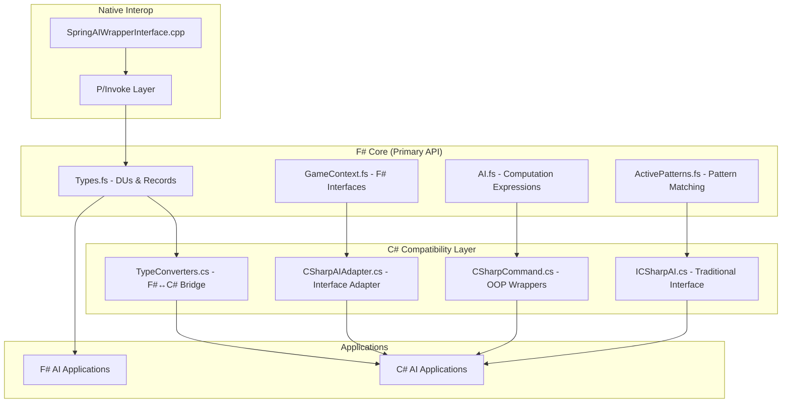

# F#-First .NET AI Wrapper Architecture Summary

## Overview

This document summarizes the **F#-first design approach** for the RecoilEngine/Spring AI wrapper, demonstrating how F# can be the primary API with C# as a secondary compatibility layer.

## Architecture Layers



## Key Benefits of F#-First Design

### 1. **Superior Type System**

```fsharp
// F# Core - Compile-time unit safety
[<Measure>] type metal
[<Measure>] type energy

let canAfford (cost: float32<metal>) (available: float32<metal>) = 
    available >= cost  // Type-safe comparison

// C# gets this safety through the wrapper
```

### 2. **Null Safety**

```fsharp
// F# Core - No null reference exceptions
type IGameContext =
    abstract member GetUnit: int -> UnitInfo option  // Never null

// C# gets nullable types that map to F# options
public UnitInfo? GetUnit(int unitId) // Compiler enforces null checks
```

### 3. **Exhaustive Pattern Matching**

```fsharp
// F# Core - Compiler guarantees all cases handled
let processEvent event =
    match event with
    | GameStarted(aiId, saved) -> initializeAI aiId saved
    | FrameUpdate frame -> updateFrame frame
    | UnitCreated(id, builder, frame) -> handleUnitCreation id builder
    | UnitDamaged(id, attacker, damage, frame) -> handleDamage id attacker damage
    | UnitDestroyed(id, attacker, frame) -> handleDestruction id attacker
    | GameEnded reason -> shutdown reason
    // Compiler error if any case is missing!
```

### 4. **Computation Expressions for AI Logic**

```fsharp
// F# Core - Clean error handling and validation
let aiDecision = aiDecision {
    let! builders = getAvailableBuilders()
    let! location = findOptimalLocation()
    let! resources = validateResources(100.0f<metal>, 50.0f<energy>)
    
    do! ensureBuildable location "armlab"
    let! command = createBuildCommand builders.[0] "armlab" location
    
    return { Action = command
             Priority = 8
             Reason = "Tech advancement required"
             EstimatedDuration = Some 300<frame> }
}

// C# benefits from this through the adapter without needing to understand F#
```

## File Structure

```
AI/Wrappers/DotNet/
├── src/
│   ├── fsharp-core/                    # Primary F# API
│   │   ├── SpringAI.Core.fsproj
│   │   ├── Types.fs                    # DUs, records, units of measure
│   │   ├── GameContext.fs              # F# interfaces & context
│   │   ├── AI.fs                       # F# AI interface & comp expressions
│   │   └── ActivePatterns.fs           # Pattern matching helpers
│   │
│   ├── csharp-compat/                  # C# compatibility layer
│   │   ├── SpringAI.CSharp.csproj
│   │   ├── AI/
│   │   │   ├── ICSharpAI.cs            # Traditional C# interface
│   │   │   ├── CSharpAIAdapter.cs      # F#↔C# bridge
│   │   │   └── BaseCSharpAI.cs         # C# base class
│   │   ├── Commands/
│   │   │   └── CSharpCommand.cs        # C# command classes
│   │   ├── Compatibility/
│   │   │   └── TypeConverters.cs       # F#↔C# type conversion
│   │   └── Events/
│   │       └── CSharpEvents.cs         # C# event classes
│   │
│   ├── managed/                        # Legacy/transition code
│   └── native/                         # Native C++ interop
│
├── examples/
│   ├── FSharp/                         # F# example AIs
│   │   ├── BasicFSharpAI.fs
│   │   └── AdvancedFSharpAI.fs
│   └── CSharp/                         # C# example AIs using F# core
│       ├── ExampleCSharpAI.cs
│       └── AdvancedCSharpAI.cs
│
└── docs/
    ├── Architecture.md
    ├── BarIntegration.md
    └── FSharpConsiderations.md        # This document
```

## Usage Examples

### F# Primary Usage (Recommended)

```fsharp
open SpringAI.Core

type MyFSharpAI(context: IGameContext) =
    inherit BaseFSharpAI(context)
    
    override this.CreateBuildPlan resourceState =
        aiDecision {
            match resourceState with
            | ResourceRich -> 
                let! builders = this.Context.GetFriendlyUnits() |> List.filter (|Builder|)
                return builders |> List.map (fun b -> 
                    { Action = Build(b.Id, "armvp", b.Position)
                      Priority = 8
                      Reason = "Military expansion" 
                      RequiredResources = Some resourceState
                      EstimatedDuration = Some 300<frame> })
            | ResourcePoor ->
                return []
        }
```

### C# Compatibility Usage

```csharp
using SpringAI.CSharp.AI;
using SpringAI.CSharp.Commands;

public class MyCSharpAI : BaseCSharpAI
{
    protected override void ProcessUpdate(int frame, ResourceState resources, Strategy strategy)
    {
        // C# code benefits from F# type safety and validation
        var builders = GetFriendlyUnits().Where(u => u.IsBuilder).ToList();
        
        foreach (var builder in builders)
        {
            if (resources.CanAfford(100, 50))
            {
                // Command goes through F# validation automatically
                var command = new BuildCommand(builder.Id, "armlab", builder.Position);
                var fsharpCommand = TypeConverters.ToFSCommand(command);
                ExecuteCommand(fsharpCommand); // F# handles validation & execution
            }
        }
    }
}
```

## Migration Strategy

### Phase 1: Current State ✅
- F# core types and interfaces implemented
- C# compatibility layer created
- Type converters for seamless interop
- Example implementations for both languages

### Phase 2: Complete Implementation
- [ ] Full native interop integration
- [ ] Complete event system implementation
- [ ] Performance optimization
- [ ] Comprehensive testing

### Phase 3: Advanced Features
- [ ] F# type providers for BAR unit definitions
- [ ] Advanced computation expressions for strategy DSLs
- [ ] Real-time debugging and profiling tools
- [ ] Hot-reload development environment

## Advantages for Different Developer Types

### F# Developers (Primary Target)
- **Full power**: Access to all F# language features
- **Type safety**: Units of measure, DUs, pattern matching
- **Composition**: Computation expressions, partial application
- **Performance**: Zero-overhead abstractions

### C# Developers (Compatibility)
- **Familiar APIs**: Traditional OOP interfaces
- **Gradual adoption**: Can learn F# concepts incrementally
- **Safety benefits**: Get F#'s type safety automatically
- **Modern C#**: Uses latest C# features (pattern matching, nullable types)

### Mixed Teams
- **Interoperability**: Seamless F#↔C# integration
- **Best of both**: F# for complex logic, C# for familiar patterns
- **Incremental migration**: Convert modules one at a time
- **Shared infrastructure**: Same underlying F# core

## Conclusion

The F#-first design provides:

1. **Better APIs** due to F#'s superior type system
2. **Fewer bugs** through compile-time safety
3. **Cleaner code** with functional programming patterns
4. **Full C# compatibility** for gradual adoption
5. **Performance benefits** from F#'s efficient compilation

This approach gives the .NET BAR AI community the best possible foundation for building sophisticated, reliable, and maintainable AI implementations while preserving accessibility for C# developers.

The key insight is that **F# makes the C# experience better too** by forcing better API design, eliminating common error patterns, and providing robust type safety that C# developers benefit from automatically through the compatibility layer.
