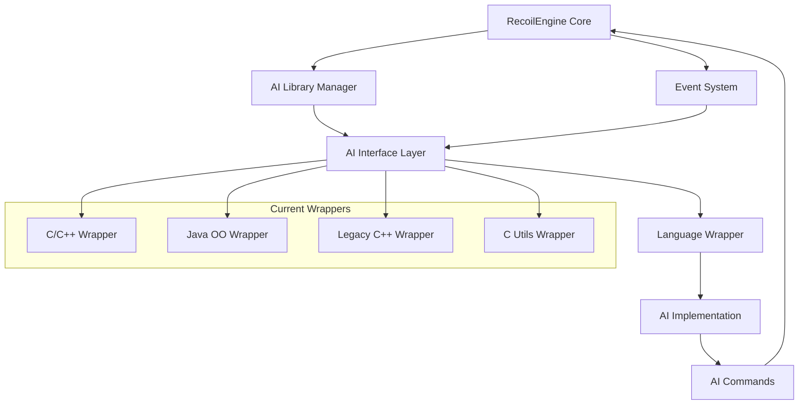
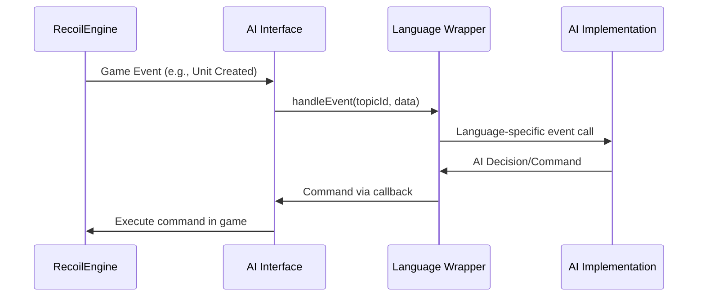
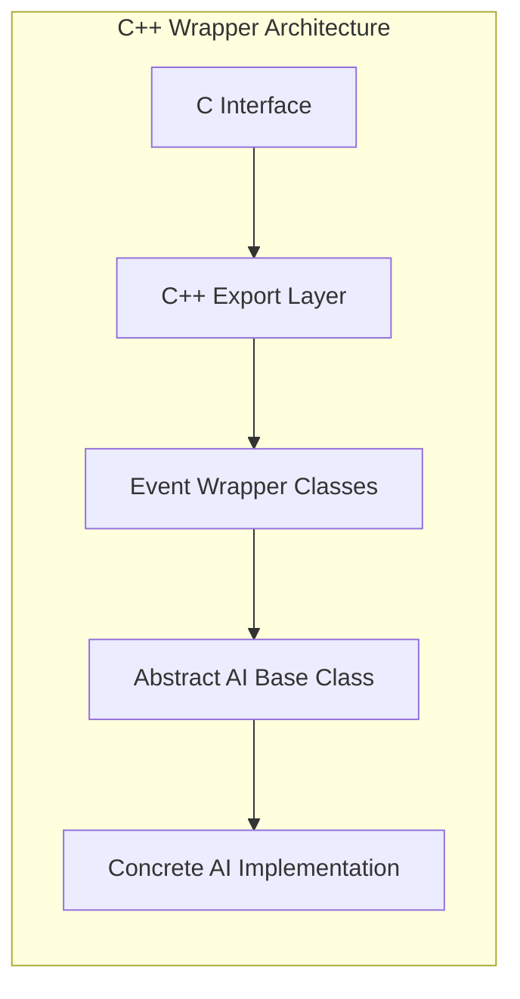
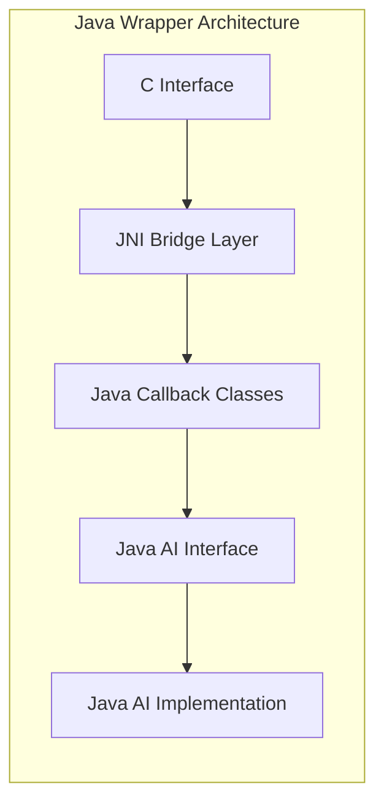
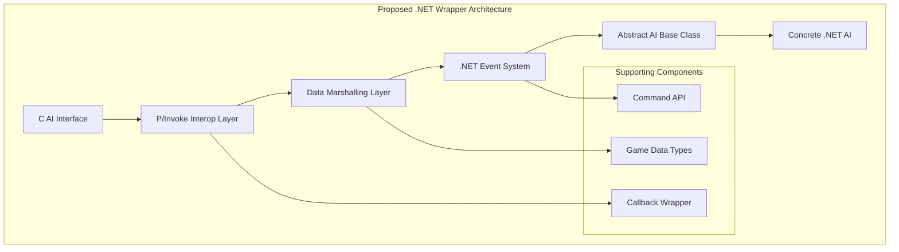
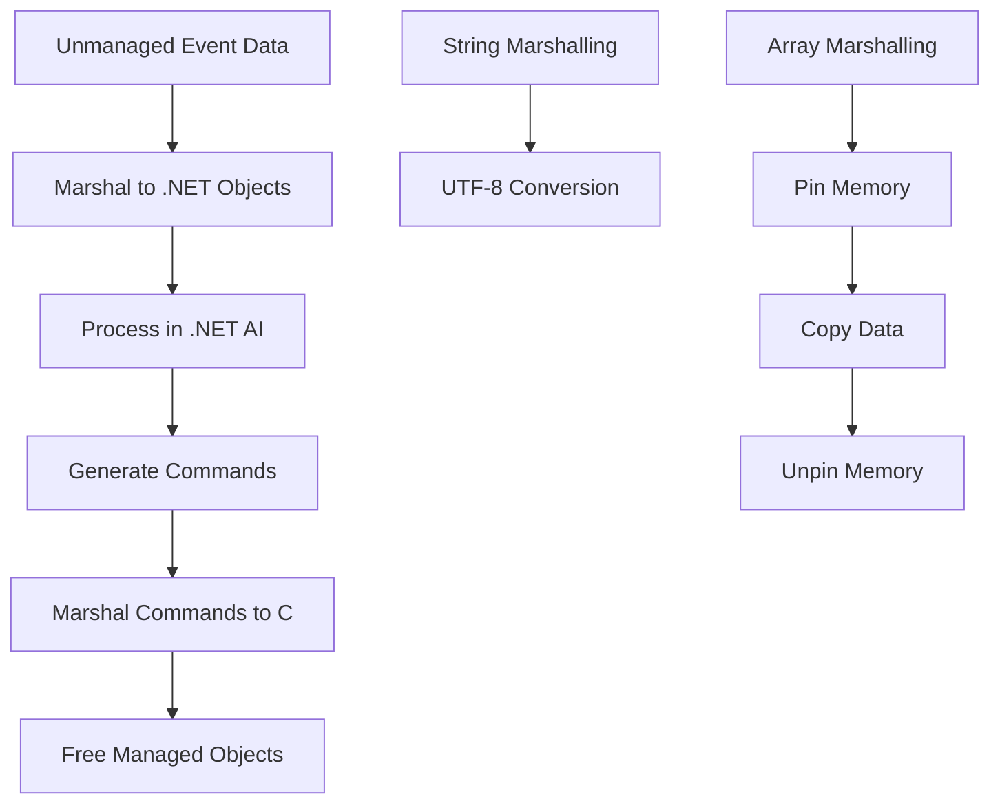

# RecoilEngine/Spring AI Architecture Analysis for .NET Wrapper

## Executive Summary

This document provides a comprehensive architecture analysis of the RecoilEngine (Spring) AI system and outlines the requirements for implementing a .NET wrapper for AI development. RecoilEngine uses a layered AI interface architecture that allows external AI implementations to control game units through a standardized callback system.

## Current AI Architecture Overview

### Core Components



### Interface Layer Architecture

The AI system is built on a three-tier architecture:

1. **Engine Core**: The main game engine that manages game state
2. **AI Interface Layer**: C-based interface that handles communication between engine and AI implementations
3. **Language Wrappers**: Language-specific wrappers that provide idiomatic APIs for different programming languages

### Key Interface Files

| Component | Purpose | Key Files |
|-----------|---------|-----------|
| **AI Interface** | Core C interface definitions | `SSkirmishAILibrary.h`, `SAIInterfaceCallback.h` |
| **Events System** | Event definitions and handling | `AISEvents.h` |
| **Commands System** | Command definitions for AI actions | `AISCommands.h` |
| **C Interface** | Native C implementation | `AI/Interfaces/C/src/Interface.h` |

## Event-Driven Architecture

### Event Flow



### Event Types

The system supports 28 different event types including:

- **Lifecycle Events**: `EVENT_INIT`, `EVENT_RELEASE`, `EVENT_UPDATE`
- **Unit Events**: `EVENT_UNIT_CREATED`, `EVENT_UNIT_FINISHED`, `EVENT_UNIT_DAMAGED`, `EVENT_UNIT_DESTROYED`
- **Enemy Events**: `EVENT_ENEMY_ENTER_LOS`, `EVENT_ENEMY_DAMAGED`, `EVENT_ENEMY_DESTROYED`
- **Game Events**: `EVENT_WEAPON_FIRED`, `EVENT_PLAYER_COMMAND`, `EVENT_SEISMIC_PING`

### Core Data Structures

```c
// Core AI Library Structure
struct SSkirmishAILibrary {
    // Lifecycle functions
    int (*init)(int skirmishAIId, const struct SSkirmishAICallback* callback);
    int (*release)(int skirmishAIId);
    int (*handleEvent)(int skirmishAIId, int topicId, const void* data);
    
    // Support level checking
    enum LevelOfSupport (*getLevelOfSupportFor)(
        const char* aiShortName, const char* aiVersion,
        const char* engineVersionString, int engineVersionNumber,
        const char* aiInterfaceShortName, const char* aiInterfaceVersion);
};

// Event Examples
struct SUnitCreatedEvent {
    int unit;
    int builder;
};

struct SUnitDamagedEvent {
    int unit;
    int attacker;
    float damage;
    float* dir_posF3;
    int weaponDefId;
    bool paralyzer;
};
```

## Existing Wrapper Analysis

### C++ Wrapper Pattern

The existing C++ wrapper demonstrates the standard pattern:



### Java OO Wrapper Pattern

The Java wrapper shows how to bridge to managed languages:



## .NET Wrapper Requirements

### Architecture Design



### Key Components to Implement

#### 1. Core Interop Layer
- **P/Invoke declarations** for all C interface functions
- **Structure marshalling** for event data and callbacks
- **Memory management** for unmanaged resources
- **Error handling** and exception translation

#### 2. Event System
```csharp
// Example event structure
public abstract class AIEvent
{
    public abstract void Handle(IAI ai);
}

public class UnitCreatedEvent : AIEvent
{
    public int UnitId { get; set; }
    public int BuilderId { get; set; }
    
    public override void Handle(IAI ai)
    {
        ai.OnUnitCreated(UnitId, BuilderId);
    }
}
```

#### 3. AI Base Classes
```csharp
public interface IAI
{
    void OnInit(int teamId);
    void OnUpdate(int frame);
    void OnUnitCreated(int unitId, int builderId);
    void OnUnitDamaged(int unitId, int attackerId, float damage);
    // ... other events
}

public abstract class BaseAI : IAI
{
    protected IGameCallback Callback { get; private set; }
    
    public virtual void OnInit(int teamId) { }
    public virtual void OnUpdate(int frame) { }
    // Default implementations...
}
```

#### 4. Command API
```csharp
public interface IGameCallback
{
    void GiveOrder(int unitId, Command command);
    Unit GetUnit(int unitId);
    float3 GetUnitPosition(int unitId);
    IEnumerable<Unit> GetFriendlyUnits();
    IEnumerable<Unit> GetEnemyUnits();
    // ... other game queries
}
```

### Data Type Mapping

| C Type | .NET Type | Marshalling |
|--------|-----------|-------------|
| `int` | `int` | Direct |
| `float` | `float` | Direct |
| `float*` | `float[]` or `Vector3` | Array/Custom |
| `char*` | `string` | `[MarshalAs(UnmanagedType.LPStr)]` |
| `void*` | `IntPtr` | Manual marshalling required |
| Function pointers | `delegate` | `[UnmanagedFunctionPointer]` |

### Memory Management Strategy



### Build System Integration

#### CMakeLists.txt Structure
```cmake
### .NET AI Wrapper
set(myName "DotNet")

# Check if .NET SDK is available
find_package(DotNet REQUIRED)

if(DOTNET_FOUND AND NOT myName MATCHES "${AI_EXCLUDE_REGEX}")
    set_global(BUILD_${myName}_AIWRAPPER TRUE)
    
    # Build native interop library
    add_library(${myName}-AIWrapper-Native SHARED
        src/native/DotNetExport.cpp
        src/native/DotNetInterface.cpp
    )
    
    # Build .NET assembly
    add_custom_target(${myName}-AIWrapper-Managed
        COMMAND dotnet build src/managed/SpringAI.Wrapper.csproj
        WORKING_DIRECTORY ${CMAKE_CURRENT_SOURCE_DIR}
    )
    
    add_dependencies(${myName}-AIWrapper-Managed ${myName}-AIWrapper-Native)
endif()
```

#### Project Structure
```
AI/Wrappers/DotNet/
├── CMakeLists.txt
├── src/
│   ├── native/                    # C++ interop layer
│   │   ├── DotNetExport.cpp       # AI interface exports
│   │   ├── DotNetInterface.cpp    # .NET bridge
│   │   └── DotNetInterface.h      # Headers
│   └── managed/                   # .NET code
│       ├── SpringAI.Wrapper.csproj
│       ├── Interop/               # P/Invoke declarations
│       ├── Events/                # Event classes
│       ├── Commands/              # Command classes
│       ├── Types/                 # Game data types
│       └── AI/                    # AI base classes
├── examples/                      # Example AI implementations
└── tests/                         # Unit tests
```

## Implementation Roadmap

### Phase 1: Core Infrastructure
1. **Setup build system** - CMake integration with .NET SDK
2. **Basic P/Invoke layer** - Core function declarations
3. **Event marshalling** - Basic event data conversion
4. **Simple AI base class** - Minimal working AI

### Phase 2: Complete Event System
1. **All event types** - Complete event type coverage
2. **Memory management** - Proper resource handling
3. **Error handling** - Exception translation and logging
4. **Event filtering** - Performance optimizations

### Phase 3: Command API
1. **Command marshalling** - All command types
2. **Game queries** - Unit information, map data
3. **Callback interface** - Complete game state access
4. **Type safety** - Strong typing for game objects

### Phase 4: Advanced Features
1. **Performance optimization** - Minimize marshalling overhead
2. **Debugging support** - Integration with .NET debugging tools
3. **Documentation** - Complete API documentation
4. **Examples** - Sample AI implementations

## Technical Challenges and Solutions

### Challenge 1: Memory Management
**Problem**: C interface uses raw pointers, .NET uses garbage collection
**Solution**: 
- Use `Marshal.AllocHGlobal`/`Marshal.FreeHGlobal` for long-lived data
- Pin memory temporarily for function calls using `GCHandle`
- Implement `IDisposable` pattern for resource cleanup

### Challenge 2: Callback Function Pointers
**Problem**: C interface expects function pointers, .NET uses delegates
**Solution**:
- Use `[UnmanagedFunctionPointer(CallingConvention.Cdecl)]`
- Keep delegate references alive to prevent garbage collection
- Use `Marshal.GetFunctionPointerForDelegate`

### Challenge 3: Performance
**Problem**: Marshalling overhead for frequent events like UPDATE
**Solution**:
- Cache marshalled objects where possible
- Use blittable types when feasible
- Implement event filtering to reduce unnecessary marshalling

### Challenge 4: Cross-Platform Compatibility
**Problem**: Different platforms have different calling conventions
**Solution**:
- Use conditional compilation for platform-specific code
- Test on Windows, Linux, and macOS
- Use .NET's built-in platform detection

## Conclusion

Implementing a .NET wrapper for the RecoilEngine AI system is feasible and follows established patterns from existing wrappers. The key success factors are:

1. **Proper interop design** - Clean separation between native and managed code
2. **Efficient marshalling** - Minimize performance overhead
3. **Comprehensive event handling** - Support all game events
4. **Strong typing** - Leverage .NET's type system for safety
5. **Good documentation** - Enable easy AI development

The proposed architecture provides a solid foundation for .NET AI development while maintaining compatibility with the existing C-based interface system.
