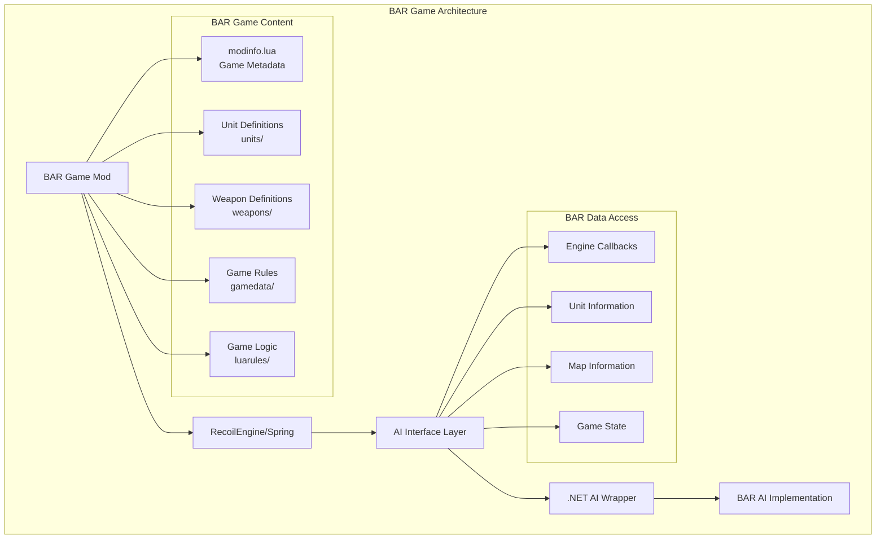
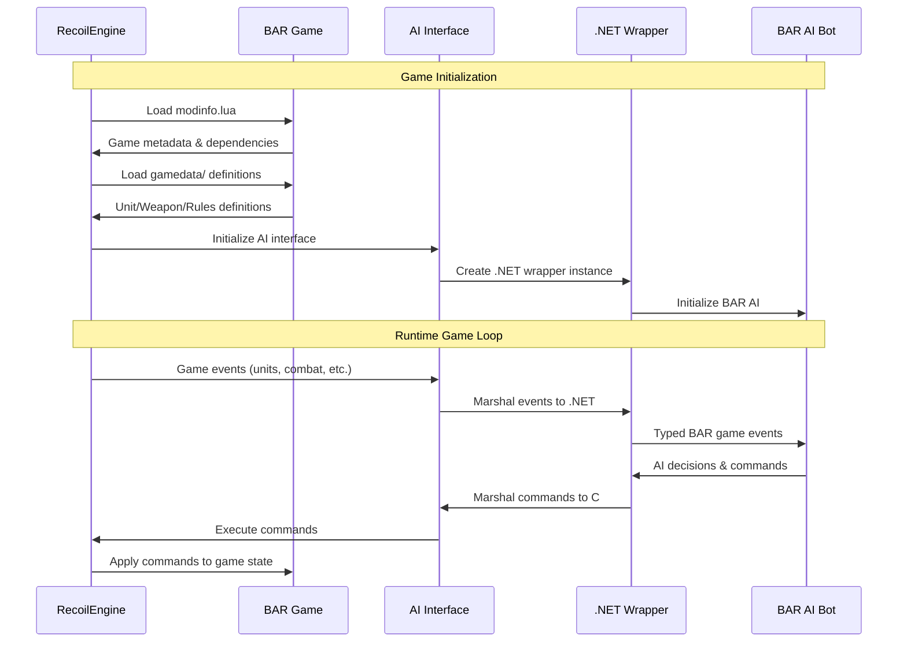

# Beyond All Reason (BAR) Integration Architecture

## Overview

Beyond All Reason (BAR) is a complete Real-Time Strategy game built on top of the RecoilEngine (Spring). This document details how BAR integrates with the general Spring engine interface and how AI implementations can access and utilize BAR-specific game data through the standardized AI interface.

## BAR Architecture Overview



## BAR Game Structure

### Core Components

BAR follows the standard Spring engine structure but extends it with comprehensive game content:

```
BAR.sdd/                          # Game root directory
├── modinfo.lua                   # Game metadata and version
├── gamedata/                     # Core game rules and definitions
│   ├── defs.lua                  # Master definitions loader
│   ├── unitdefs.lua              # Unit definition processing
│   ├── weapondefs.lua            # Weapon definition processing
│   ├── modrules.lua              # Game rule modifications
│   └── sidedata.lua              # Faction definitions
├── units/                        # Individual unit definitions
│   ├── armcom.lua                # ARM Commander
│   ├── armkbot.lua               # ARM Construction Kbot
│   ├── armveh.lua                # ARM Vehicle Constructor
│   └── ...                      # Hundreds of unit files
├── weapons/                      # Weapon definitions
├── luarules/                     # Server-side game logic
│   ├── gadgets/                  # Game behavior modules
│   └── configs/                  # Configuration files
├── luaui/                        # Client-side interface
├── objects3d/                    # 3D models
├── sounds/                       # Audio files
├── bitmaps/                      # Textures and images
└── scripts/                      # Unit behavior scripts
```

### Data Flow Architecture



## BAR-Specific Data Integration

### Unit Definition System

BAR extends the Spring engine unit system with comprehensive definitions:

#### Unit Categories
BAR organizes units into hierarchical categories:

```lua
-- Example BAR unit categories
categories = {
    -- Faction
    "ARM", "COR",           -- Primary factions
    
    -- Unit Type
    "TANK", "KBOT", "AIRCRAFT", "SHIP", "BUILDING",
    
    -- Role
    "COMMANDER", "BUILDER", "FACTORY", "WEAPON", "ENERGY", "METAL",
    
    -- Capabilities  
    "CANATTACK", "CANMOVE", "CANBUILD", "CANFLY", "CANSWIM"
}
```

#### Accessing Unit Information via AI Interface

```csharp
// .NET AI Implementation accessing BAR unit data
public class BARUnitAnalyzer 
{
    public void AnalyzeUnit(int unitId)
    {
        // Get unit definition ID
        var unitDefId = Callback.GetUnitDefId(unitId);
        
        // Access BAR-specific unit properties through engine interface
        var unitName = Callback.GetUnitDefName(unitDefId);        // e.g., "armcom"
        var categories = Callback.GetUnitCategories(unitDefId);   // e.g., "ARM COMMANDER CANATTACK"
        var buildOptions = Callback.GetUnitBuildOptions(unitDefId);
        
        // BAR faction detection
        bool isARM = categories.Contains("ARM");
        bool isCOR = categories.Contains("COR");
        
        // BAR role detection
        bool isCommander = categories.Contains("COMMANDER");
        bool isBuilder = categories.Contains("BUILDER");
        bool isFactory = categories.Contains("FACTORY");
        
        // Use BAR-specific logic
        if (isCommander) {
            HandleCommanderUnit(unitId, unitDefId);
        } else if (isFactory) {
            HandleFactoryUnit(unitId, unitDefId, buildOptions);
        }
    }
}
```

### Weapon System Integration

BAR has an extensive weapon system accessible through the standard interface:

```csharp
public class BARWeaponAnalyzer
{
    public void AnalyzeWeapons(int unitDefId)
    {
        // Get weapon definitions through engine interface
        var weaponCount = Callback.GetUnitWeaponCount(unitDefId);
        
        for (int i = 0; i < weaponCount; i++) {
            var weaponDefId = Callback.GetUnitWeapon(unitDefId, i);
            var weaponName = Callback.GetWeaponDefName(weaponDefId);
            var damage = Callback.GetWeaponDamage(weaponDefId);
            var range = Callback.GetWeaponRange(weaponDefId);
            var weaponType = Callback.GetWeaponType(weaponDefId);
            
            // BAR-specific weapon analysis
            if (weaponName.Contains("disintegrator")) {
                // Handle D-Gun weapons
                ConfigureCommanderWeapon(unitDefId, weaponDefId);
            } else if (weaponType == "BeamLaser") {
                // Handle laser weapons common in BAR
                ConfigureLaserWeapon(unitDefId, weaponDefId);
            }
        }
    }
}
```

### Economy System Access

BAR uses the standard Spring economy but with specific balance:

```csharp
public class BAREconomyManager
{
    public void ManageResources()
    {
        // Standard Spring economy interface works with BAR
        float metal = Callback.GetMetal();
        float energy = Callback.GetEnergy();
        float metalIncome = Callback.GetMetalIncome();
        float energyIncome = Callback.GetEnergyIncome();
        
        // BAR-specific economic strategies
        float metalRatio = metal / Callback.GetMetalStorage();
        float energyRatio = energy / Callback.GetEnergyStorage();
        
        if (metalRatio < 0.2f) {
            // Build metal extractors or reclaimers
            BuildMetalProduction();
        }
        
        if (energyRatio < 0.3f) {
            // Build energy production (solar/wind/geo)
            BuildEnergyProduction();
        }
    }
}
```

## BAR Game Rules and ModOptions

### ModOptions Integration

BAR provides extensive customization through mod options:

```lua
-- Example BAR modoptions.lua structure
local options = {
    {
        key = "startmetal",
        name = "Starting Metal",
        desc = "Initial metal amount for each player",
        type = "number",
        def = 1000,
        min = 0,
        max = 10000
    },
    {
        key = "difficulty",
        name = "AI Difficulty",
        desc = "Difficulty level for AI opponents",
        type = "list",
        def = "Normal",
        items = {"Easy", "Normal", "Hard", "Brutal"}
    }
}
```

Accessing mod options in AI:

```csharp
public class BARGameConfiguration
{
    public void ReadGameSettings()
    {
        // Access mod options through engine interface
        var modOptions = Callback.GetModOptions();
        
        int startMetal = int.Parse(modOptions.GetValueOrDefault("startmetal", "1000"));
        string difficulty = modOptions.GetValueOrDefault("difficulty", "Normal");
        
        // Adapt AI strategy based on game settings
        if (difficulty == "Brutal") {
            aggressionLevel = 1.5f;
            economicFocus = 0.8f;
        }
        
        // Use starting metal information for early game strategy
        if (startMetal > 2000) {
            enableRushStrategy = true;
        }
    }
}
```

### Game Rules Access

BAR customizes engine behavior through modrules:

```csharp
public class BARGameRules
{
    public void InitializeGameRules()
    {
        // Engine exposes mod rules through standard interface
        bool constructionDecay = Callback.GetModRule("constructionDecay");
        float reclaimSpeed = Callback.GetModRuleFloat("reclaimSpeed");
        int maxUnits = Callback.GetModRuleInt("maxUnits");
        
        // Adapt AI behavior to game rules
        if (constructionDecay) {
            // Prioritize faster construction completion
            builderAllocationStrategy = BuilderStrategy.FastCompletion;
        }
        
        if (maxUnits < 500) {
            // Focus on quality over quantity
            unitProductionStrategy = ProductionStrategy.Elite;
        }
    }
}
```

## BAR Unit Identification Patterns

### Faction Detection

```csharp
public enum BARFaction { ARM, COR, Unknown }

public class BARUnitClassifier
{
    public BARFaction IdentifyFaction(int unitDefId)
    {
        string unitName = Callback.GetUnitDefName(unitDefId);
        string categories = Callback.GetUnitCategories(unitDefId);
        
        // BAR naming conventions
        if (unitName.StartsWith("arm") || categories.Contains("ARM")) {
            return BARFaction.ARM;
        } else if (unitName.StartsWith("cor") || categories.Contains("COR")) {
            return BARFaction.COR;
        }
        
        return BARFaction.Unknown;
    }
    
    public BARUnitRole ClassifyRole(int unitDefId)
    {
        string categories = Callback.GetUnitCategories(unitDefId);
        
        if (categories.Contains("COMMANDER")) return BARUnitRole.Commander;
        if (categories.Contains("BUILDER")) return BARUnitRole.Builder;
        if (categories.Contains("FACTORY")) return BARUnitRole.Factory;
        if (categories.Contains("WEAPON")) return BARUnitRole.Combat;
        if (categories.Contains("ENERGY")) return BARUnitRole.Energy;
        if (categories.Contains("METAL")) return BARUnitRole.Metal;
        
        return BARUnitRole.Unknown;
    }
}
```

### Build Order Management

```csharp
public class BARBuildOrderManager
{
    public void DetermineOptimalBuildOrder()
    {
        var faction = IdentifyPlayerFaction();
        
        switch (faction) {
            case BARFaction.ARM:
                // ARM typically has stronger economy early game
                buildOrder = new[] {
                    "armsolar",    // Solar panel
                    "armkbot",     // Construction kbot
                    "armvp",       // Kbot factory
                    "armrock"      // Rocket kbot
                };
                break;
                
            case BARFaction.COR:
                // COR typically focuses on heavy units
                buildOrder = new[] {
                    "corsolar",    // Solar panel
                    "corveh",      // Construction vehicle
                    "corvp",       // Vehicle factory
                    "corraid"      // Raider tank
                };
                break;
        }
    }
}
```

## Map Integration

### BAR Map Features

BAR maps contain specific features accessible through the engine:

```csharp
public class BARMapAnalyzer
{
    public void AnalyzeMap()
    {
        // Standard Spring map interface works with BAR maps
        int mapWidth = Callback.GetMapWidth();
        int mapHeight = Callback.GetMapHeight();
        
        // Analyze metal spots (crucial for BAR economy)
        var metalSpots = Callback.GetMetalSpots();
        foreach (var spot in metalSpots) {
            float metalDensity = spot.MetalAmount;
            Vector3 position = spot.Position;
            
            // Plan metal extractor placement
            if (metalDensity > 1.5f) {
                PlanMetalExtractor(position, "high_priority");
            }
        }
        
        // Analyze strategic positions
        var startPositions = Callback.GetStartPositions();
        var geothermalVents = Callback.GetGeothermalFeatures();
        
        // BAR-specific map strategy
        if (geothermalVents.Any()) {
            PlanGeothermalExpansion(geothermalVents);
        }
    }
}
```

## AI Interface Extensions for BAR

### Custom BAR Event Handlers

```csharp
public class BARSpecificAI : BaseAI
{
    private BARUnitClassifier unitClassifier;
    private BAREconomyManager economyManager;
    private BARBuildOrderManager buildManager;
    
    public override void OnInit(int skirmishAIId, bool savedGame)
    {
        base.OnInit(skirmishAIId, savedGame);
        
        unitClassifier = new BARUnitClassifier();
        economyManager = new BAREconomyManager();
        buildManager = new BARBuildOrderManager();
        
        // Initialize BAR-specific systems
        InitializeBARGameRules();
        AnalyzeBARMap();
        DetermineBARStrategy();
    }
    
    public override void OnUnitCreated(int unitId, int builderId)
    {
        base.OnUnitCreated(unitId, builderId);
        
        // BAR-specific unit handling
        var unitDefId = Callback.GetUnitDefId(unitId);
        var faction = unitClassifier.IdentifyFaction(unitDefId);
        var role = unitClassifier.ClassifyRole(unitDefId);
        
        switch (role) {
            case BARUnitRole.Commander:
                HandleCommanderCreated(unitId, faction);
                break;
            case BARUnitRole.Factory:
                RegisterFactory(unitId, faction);
                break;
            case BARUnitRole.Builder:
                AssignBuilderToQueue(unitId);
                break;
        }
    }
    
    public override void OnUnitDamaged(int unitId, int attackerId, float damage, Vector3 direction, int weaponDefId, bool paralyzer)
    {
        base.OnUnitDamaged(unitId, attackerId, damage, direction, weaponDefId, paralyzer);
        
        // BAR-specific damage response
        var unitDefId = Callback.GetUnitDefId(unitId);
        if (unitClassifier.ClassifyRole(unitDefId) == BARUnitRole.Commander) {
            // Commander under attack - emergency response
            ImplementCommanderDefense(unitId, attackerId);
        }
    }
}
```

## Performance Considerations

### Efficient BAR Data Access

```csharp
public class BARDataCache
{
    private Dictionary<int, BARUnitInfo> unitCache = new();
    private Dictionary<string, int> unitNameToDefId = new();
    
    public BARUnitInfo GetUnitInfo(int unitDefId)
    {
        if (!unitCache.ContainsKey(unitDefId)) {
            // Cache BAR unit information for performance
            unitCache[unitDefId] = new BARUnitInfo {
                Name = Callback.GetUnitDefName(unitDefId),
                Faction = DetermineFaction(unitDefId),
                Role = DetermineRole(unitDefId),
                BuildOptions = Callback.GetUnitBuildOptions(unitDefId),
                Categories = Callback.GetUnitCategories(unitDefId)
            };
        }
        
        return unitCache[unitDefId];
    }
}
```

## Conclusion

BAR integrates seamlessly with the RecoilEngine AI interface while providing rich game content and mechanics. AI implementations can:

1. **Access BAR content** through standard Spring engine callbacks
2. **Identify BAR-specific units** using naming conventions and categories  
3. **Utilize BAR game rules** through mod options and game state queries
4. **Implement BAR strategies** using faction-specific knowledge and unit roles
5. **Optimize for BAR gameplay** through caching and efficient data access patterns

The .NET wrapper provides a clean, strongly-typed interface to all BAR functionality while maintaining compatibility with the underlying Spring engine architecture. This allows AI developers to focus on strategy implementation rather than low-level engine integration.
